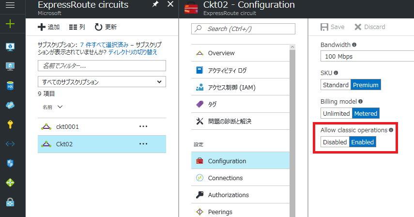

> [!WARNING]
> 本記事は、投稿より時間が経過しており、<strong>内容が古い可能性があります。</strong>
>
> 最新の情報については、<strong>以下の公式ドキュメントをご参照ください。</strong>
>
> [クラシック デプロイ モデルから Resource Manager デプロイ モデルへの ExpressRoute 回線の移行](https://learn.microsoft.com/ja-jp/azure/expressroute/expressroute-move)

こんにちは、Azure サポートチームの飯塚です。

本日アナウンスがありました、ExpressRoute のデプロイ モデルの変更についてご案内いたします。

<!-- more -->

## ExpressRoute のデプロイ モデルについて

ExpressRoute に限ったものではありませんが、現在、Azure には以下の 2 種類のデプロイ モデルがあります。

リソースの種類によって例外もありますが、ExpressRoute 回線については、2017 年 2 月 2 日時点で、どちらのモデルでも作成が可能です。

- クラシック デプロイ モデル (旧来のモデル)
- リソース マネージャー デプロイ モデル (新しいモデル)

それぞれのデプロイ モデルの概要は、以下の公開資料を参考にご覧いただければと思います。

https://docs.microsoft.com/ja-jp/azure/resource-manager-deployment-model

## 今回のアナウンスの内容
今回のデプロイ モデルの変更のアナウンスは、「2017 年 3 月 1 日以降は、クラシック デプロイ モデルでは ExpressRoute 回線の新規作成が行えなくなる」というものです。つまり、2017 年 3 月 1 日以降は、ExpressRoute 回線を作成する際は、リソース マネージャー モデルの手順をご実施いただく必要がございます。

以下の公開資料は、クラシック デプロイ モデルとリソース マネージャー デプロイ モデルそれぞれにおける、ExpressRoute 回線の作成手順をご案内しているものです。2017 年 3 月 1 日以降は、リソース マネージャー デプロイ モデルの手順しかご利用いただけなくなります。

クラシック デプロイ モデルの手順 >>> 3 月以降ご利用いただけない手順

https://docs.microsoft.com/ja-jp/azure/expressroute/expressroute-howto-circuit-classic

リソース マネージャー デプロイ モデルの手順 (PowerShell) >>> 引き続きご利用いただける手順

https://docs.microsoft.com/ja-jp/azure/expressroute/expressroute-howto-circuit-arm

リソース マネージャー デプロイ モデルの手順 (ポータル画面) >>> 引き続きご利用いただける手順

https://docs.microsoft.com/ja-jp/azure/expressroute/expressroute-howto-circuit-portal-resource-manager

## 今回の変更における影響

今回の変更は、あくまで、ExpressRoute 回線を作成する際の手順に関するものです。たとえば既存の ExpressRoute 回線が 3 月以降に停止するような予定はございませんので、ご安心いただければと思います。

ただし将来的には、リソース マネージャー デプロイ モデルの回線でのみ利用できる新機能などが実装される可能性がございます。このため、現在クラシック デプロイ モデルで作成されている ExpressRoute 回線については、リソース マネージャー デプロイ モデルへの移行を推奨いたします。

既存のクラシック デプロイ モデルの回線をリソース マネージャー デプロイ モデルに変更する手順は、以下の資料でご説明差し上げております。回線の移行作業にあたっては特に通信断は発生せず、また既存で接続されているクラシック デプロイ モデルの仮想ネットワークも、そのまま維持されます。

https://docs.microsoft.com/ja-jp/azure/expressroute/expressroute-howto-move-arm

## 本件に関する FAQ

#### Q1. 既存の ExpressRoute 回線が突然停止しますか？

A1. 既存の ExpressRoute 回線が停止する予定はなく、サポートも継続されます。
ただし、上記のとおり、リソース マネージャー デプロイ モデルへの移行を推奨いたします。

#### Q2. クラシックの仮想ネットワークは、もう接続できないのでしょうか？

A2. いいえ、リソース マネージャー デプロイ モデルで作成した ExpressRoute 回線にも、クラシックの仮想ネットワークを接続することができます。この場合、以下のいずれかの手順で、リソース マネージャー デプロイ モデルで作成した ExpressRoute 回線に対して、クラシック デプロイ モデルのアクセスを許可してください。
1. 以下の資料における「両方のデプロイ モデルに対して ExpressRoute 回線を有効にする」項における PowerShell のコマンドを実行する
https://docs.microsoft.com/ja-jp/azure/expressroute/expressroute-howto-move-arm

2. ポータル画面 (https://portal.azure.com/) における [ExpressRoute Circuits] で、対象の回線の [Configuration] から [Allow classic operations] を [Enabled] に変更する

#### Q3. 既存の ExpressRoute 回線がどちらのデプロイ モデルか、どこで確認すればいいですか？
A3. 確認方法の一例ですが、ポータル画面 (https://portal.azure.com/) の [ExpressRoute Circuits] に回線が表示されていれば、リソース マネージャー デプロイ モデルです。そうでない場合は、クラシック デプロイ モデルです。