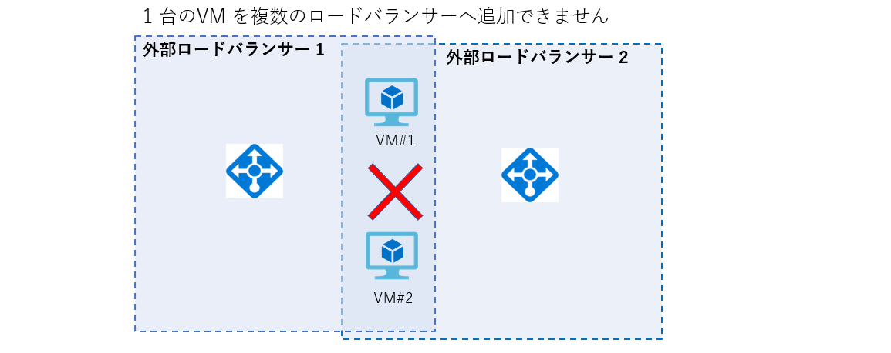
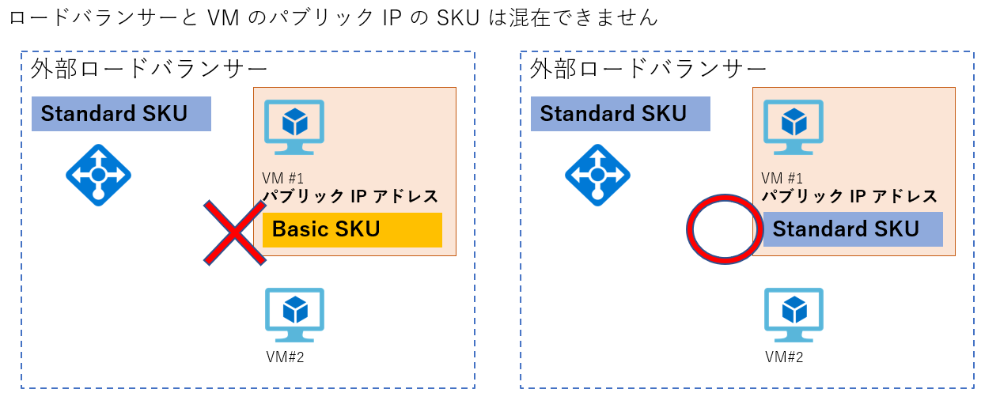
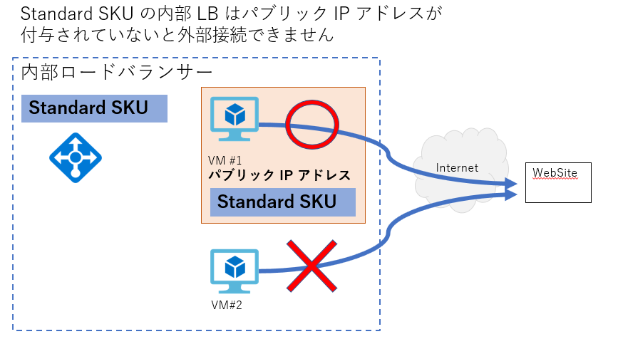
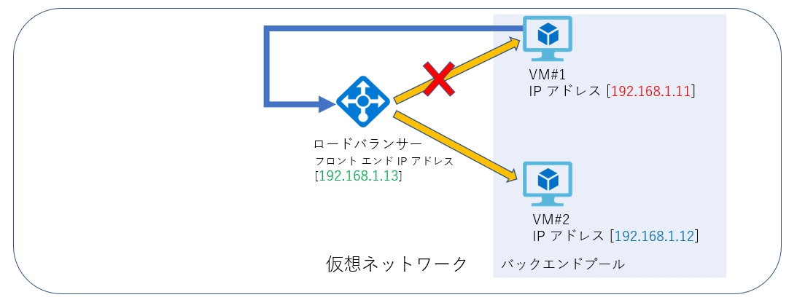
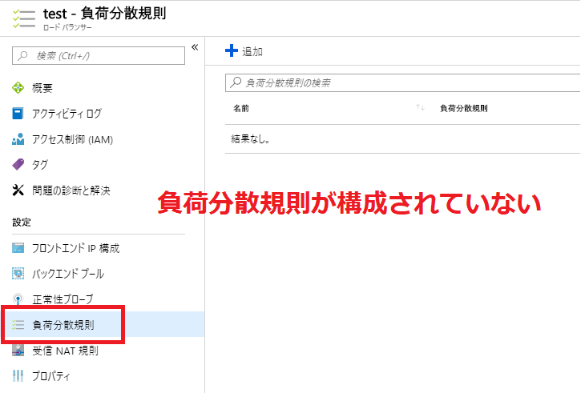
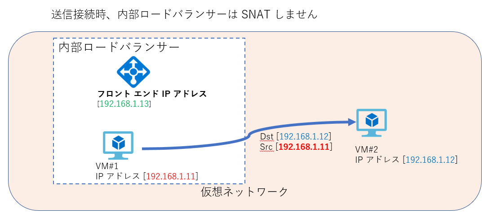

> [!WARNING]
> 本記事は、投稿より時間が経過しており、**一部内容が古い可能性があります。**

こんにちは、Azure サポートチームの檜山です。

今回は Azure ロードバランサーの利用にあたり、よくあるお問い合わせで代表的なものについてご紹介させていただきます。

Azure ロードバランサー利用時に想定した動作ができないといった時に制限事項にあてはまっている場合がございますので、そのような時はご一読いただけますと幸いです。

また、Azure ロードバランサーを経由した通信のトラブルシューティングについては以下もご参照ください。

[ロードバランサー経由での通信ができない場合のチェックポイント](https://www.syuheiuda.com/?p=4875)

## Azure ロードバランサー (内部 [プライベートIP] / 外部 [パブリック IP]) 利用時のよくあるお問合せ

Azure ロードバランサー利用時のよくあるお問合せとして以下のようなものがあります。

- [ロードバランサーのバックエンドプールに VM を追加できない](#ロードバランサーのバックエンドプールに-VM-を追加できない)
- [ロードバランサーのバックエンドプールに追加したら外部へ接続できなくなった](#ロードバランサーのバックエンドプールに追加したら外部へ接続できなくなった)
- [バックエンドプールに所属した VM からロードバランサーのフロントエンド IP アドレスにアクセスできない](#バックエンドプールに所属した-VM-からロードバランサーのフロントエンド-IP-アドレスにアクセスできない)
- [Standard SKU の外部ロードバランサーで正常性プローブは成功するが、負荷分散ができない](#Standard-SKU-の外部ロードバランサーで正常性プローブは成功するが、負荷分散ができない)
- [ロードバランサーのフロントエンド IP アドレスの送信元 NAT (SNAT) による外部接続ができない](#ロードバランサーのフロントエンド-IP-アドレスの送信元-NAT-SNAT-による外部接続ができない)

それぞれについて以下に詳細を記載します。

## ロードバランサーのバックエンドプールに VM を追加できない

こちらの事象についてよくある原因としては以下があります。

1. **1 台の VM を複数のロードバランサーに追加しようとしている**
2. **ロードバランサーと VM に付与されているパブリック IP アドレスの SKU が異なる**

1 についてですが、Azure ロードバランサーは 1 台の VM を複数の外部ロードバランサーまたは複数の内部ロードバランサーに追加することができません。

Azure ロードバランサーに複数のフロントエンド IP アドレスを設定することで回避できる場合がありますので、ご検討ください。

また、1 台 の VM を 1 つの外部ロードバランサーと 1 つの内部ロードバランサーに所属し、負荷分散することはできます。(LB の SKU は合わせる必要があります)

2 についてですが、VM のパブリック IP アドレスが Basic SKU であった場合、Standard SKU のロードバランサーのバックエンドには追加することができません (SKU が反対の場合も同様)。

そのため、そのような構成であった場合、どちらかの SKU を変更し、SKU を合わせる必要があります。

## ロードバランサーのバックエンドプールに追加したら外部へ接続できなくなった

こちらの事象についてよくある原因としては以下があります。

1. **Standard SKU の内部ロードバランサーのバックエンドプールに所属している**

Standard SKU の内部ロードバランサーの場合、以下のどちらかの設定を行いパブリック IP アドレス経由で外部と通信できるようにする必要があります。

1. VM にパブリック IP アドレスを付与する
2. VM を外部ロードバランサーにも追加する

## バックエンドプールに所属した VM からロードバランサーのフロントエンド IP アドレスにアクセスできない

こちらの事象についてよくある原因としては以下があります。

1. **内部ロードバランサーのバックエンドに所属している VM から、その VM が所属しているロードバランサーのフロントエンド IP アドレスにアクセスしている**
   
内部ロードバランサーの動作として、自分自身がバックエンドプールとして所属するロードバランサーのフロントエンド IP アドレスに接続した際は、送信パケットと受信パケットで不一致が発生し、自ノードへはアクセスできない動作となります。

このような要件があった場合、Proxy を経由させる等で回避できる場合がございますのでご検討ください。

## Standard SKU の外部ロードバランサーで正常性プローブは成功するが、負荷分散ができない

こちらの事象についてよくある原因としては以下があります。

1. **NIC またはサブネットに NSG を適用していない**

Standard SKU の外部ロードバランサーでは NSG の受信規則によって、負荷分散用のポートを許可しない限り、トラフィックがホワイトリストとして登録されず負荷分散の通信が許可されません。

ただし、正常性プローブについては NSG が適用されていなくても成功する動作となります。

メトリック等で確認した際に正常性プローブは成功しているが、負荷分散がきないといった事象の場合、NSG の受信規則によって、負荷分散用のポートを許可して事象が改善するかをご確認ください。

## ロードバランサーのフロントエンド IP アドレスの送信元 NAT (SNAT) による外部接続ができない

こちらの事象についてよくある原因としては以下があります。

1. **VM が所属するバックエンドプールが負荷分散規則に紐づけられていない**
2. **VM にパブリック IP アドレスが付与されている**
3. **外部ロードバランサーではなく内部ロードバランサーを利用している**

1 についてですが、外部への送信接続時の SNAT はバックエンドプールを負荷分散規則に紐づけていないと利用することができません。

Standard SKU の場合は、アウトバウンド規則を利用することもできます。

- Load Balancer のアウトバウンド規則

https://docs.microsoft.com/ja-jp/azure/load-balancer/load-balancer-outbound-rules-overview

2 についてですが、VM にパブリック IP アドレスが付与されている場合はそのパブリック IP アドレスにて SNAT されるため、ロードバランサーのフロントエンド IP アドレスでは SNAT されません。

3 についてですが、内部ロードバランサーの場合は送信接続時にフロントエンド IP アドレスで SNAT されない動作となります

以上、参考になれば幸いです。