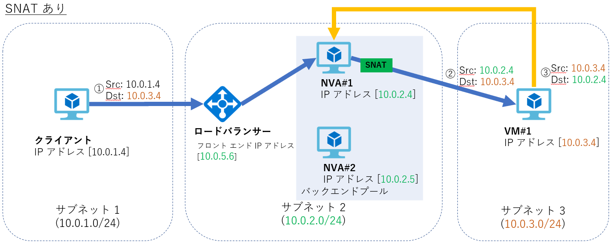

こんにちは、Azure サポートチームの檜山です。

今回は Azure 上でネットワーク仮想アプライアンス経由で想定どおりに通信ができない時の確認点についてご紹介します。

## ネットワーク仮想アプライアンスについて

ネットワーク仮想アプライアンス (Network Virtual Appliance: NVA) とはネットワークの機能やサービスが含まれた VM のことで、NVA 用の VM イメージは様々なサードパーティ ベンダが Azure Marketplace からも提供しております。

仮想ネットワーク上に NVA を構成することで、ファイアーウォールや WAN の最適化等の様々な機能を Azure 上で実現することができます。

よくある利用例としては以下のようなものがあります。

- 特定の VM 間の通信はファイアーウォールを経由させたい
- 仮想ネットワークでハブ スポークを構成したい
- Azure ロードバランサー、Azure VPN Gateway、Azure Application - Gateway で提供していない機能を使いたい
- 特定の通信は NAT ルーター経由にしたい

NVA については以下もご参照ください。

- Network Appliances

    https://azure.microsoft.com/ja-jp/solutions/network-appliances/

以下にも NVA のトラブルシューティングについてまとまっておりますので、こちらもご参照ください。

- Azure でのネットワーク仮想アプライアンスの問題

    https://docs.microsoft.com/ja-jp/azure/virtual-network/virtual-network-troubleshoot-nva

本ブログでは NVA を利用する際に、うまくつながらない時の確認すべきポイントをまとめております。

> **NVA 内部の動作についてのお問い合わせは基本的に弊社では承ることができませんので、確認が必要な場合はサードパーティ ベンダへご確認をお願いします。**

## チェックポイント
1. [ユーザー定義ルート (UDR)](#udr)
2. [IP 転送](#forwarding)
3. [ネットワーク セキュリティ グループ (NSG)](#nsg)
4. [ネットワーク アドレス変換 (NAT)](#nat)
5. [パケット キャプチャ](#capture)

## チェックポイント1 : ユーザー定義ルート (UDR)

NVA をファイアーウォールや VPN 等の用途で利用する場合、ユーザー定義ルート (UDR) の設定が必要となる場合がありますので、UDR が正しく設定されているかをご確認ください。

UDR の設定として、[ルート] の [アドレス プレフィックス] にはアクセスしたい宛先のアドレス空間、[次ホップ] には NVA の IP アドレスを指定します。

[サブネット] は NVA を経由させる通信のクライアントとなる VM が接続されたサブネットに関連付けます。

なお、Azure 内部ロードバランサーを用いて高可用性の NVA 構成にする場合、[次ホップ] にはロードバランサーのフロント エンド IP アドレスを指定します。

手順については以下もご参照ください。

- ユーザー定義ルーティング (UDR)

    https://docs.microsoft.com/ja-jp/azure/virtual-network/virtual-network-scenario-udr-gw-nva#user-defined-routing-udr

また、UDR が正しく反映されているかは [ネットワーク インターフェイス] の [有効なルート] からも確認することができます。

- ネットワーク インターフェイス設定の表示

    https://docs.microsoft.com/ja-jp/azure/virtual-network/virtual-network-network-interface#view-network-interface-settings

## チェックポイント2 : IP 転送

NVA を利用する場合、ネットワーク インターフェースの設定で [IP 転送] を有効化する必要がありますので、IP 転送が有効化されているかをご確認ください。

NVA に複数のNIC を接続し通信を制御する場合、通信を流す全ての NIC で [IP 転送] を有効化する必要があります。

サードパーティから提供される VM イメージは既定で有効となっている場合があります。

手順については以下もご参照ください。

- IP 転送の有効化と無効化

    https://docs.microsoft.com/ja-jp/azure/virtual-network/virtual-network-network-interface#enable-or-disable-ip-forwarding

## チェックポイント3 : ネットワーク セキュリティ グループ (NSG)

NSG の受信規則、送信規則にて通信を制限している環境で、NVA を経由した通信が想定どおりに動作しない場合があります。

まずは切り分けとして受信規則、送信規則共に Any to Any の通信を許可するルールを明示的に入れ、通信できるかをご確認いただくことをおすすめします。

(NSG の既定の規則では、仮想ネットワーク内同士の通信が許可されています。しかし、NVA を利用するケースにおいては、パケットの送信元や宛先が、仮想ネットワーク外のアドレスになる場合があると思います。このような、既定の規則でカバーできていない通信があることに起因して、「NSG は既定のままにしているのに、NVA にパケットが着信しない」というお問い合わせをいただくことがあります。このような問題が疑われる場合、明示的に Any to Any の通信を許可していただければ、NSG の問題かどうか切り分けることができます。)

## チェックポイント4 : ネットワーク アドレス変換 (NAT)

NVA を利用する場合に NVA 側で NAT を行う必要がある場合があります。

例えば以下のような構成の場合、クライアントから VM 1 への通信は送信元が 10.0.1.4, 宛先が 10.0.3.4 のまま VM#1 までパケットが送られますが (SNATなし ①,②)、戻りの通信は宛先が 10.0.1.4 となるため (SNATなし ③) 、NVA を経由せず通信が想定どおりにできない場合があります。

そのようなケースでは、NVA で送信元アドレス変換 (SNAT) することで (SNATあり ②) 、戻りの通信も NVA を経由するようになり (SNATあり ③) 、想定通りの通信を行うことができます。

SNAT については以下もご参照ください。

- 高可用性のネットワーク仮想アプライアンスをデプロイする

    https://docs.microsoft.com/ja-jp/azure/architecture/reference-architectures/dmz/nva-ha

## チェックポイント5 : パケット キャプチャ

上記のチェックポイントを確認後もうまく通信できない場合、クライアント、NVA、接続先の VM のそれぞれでパケット キャプチャを行い、以下の確認をすることをおすすめします。

1. クライアントにて宛先アドレスへパケットを送信できているか
2. クライアントからのパケットが NVA まで到達しているか
3. 接続先の VM までパケットが到達しているか、パケットが正しい宛先に送れているか

Windows, Linux におけるパケットキャプチャの取得手順は以下となりますので該当する場合はご参照ください。

### Windows

1. 管理者権限を持つアカウントでコマンド プロンプトを開きます。
2. 次のコマンドを実行し、キャプチャを開始します。
   - netsh trace start capture=yes
3. NVA を経由する通信を行います。
4. パケット キャプチャを停止します。
    - netsh trace stop

### Linux
1. 以下の tcpdump コマンドを実行していただくことでパケット採取が開始します。
   - sudo tcpdump -s0 -i any -n -w outfile.pcap
2. NVA を経由する通信をおこないます。
3. Ctrl + C でパケットキャプチャを停止します。
 
以上、参考になれば幸いです。