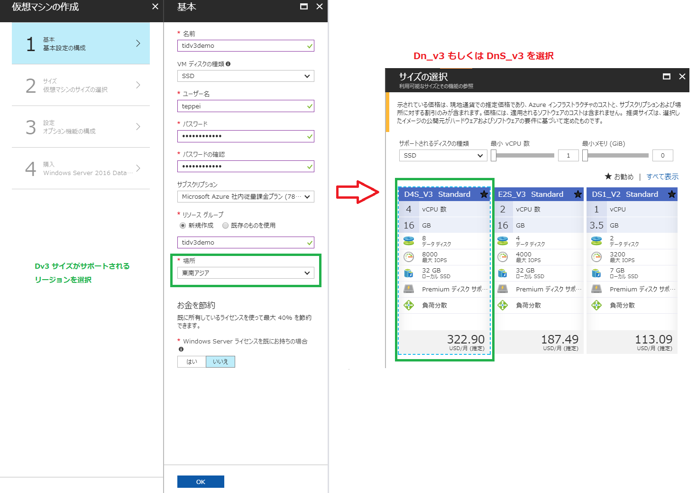
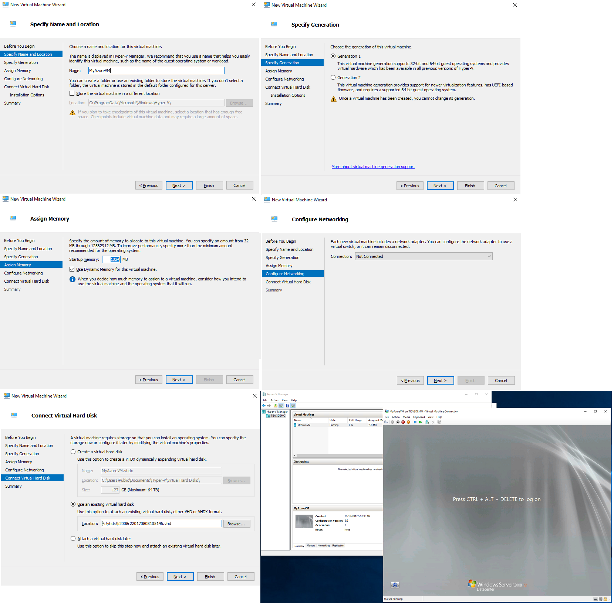

こんにちは、Azure テクニカル サポート チームの石井です。

Azure で Nested Hyper-V を使ってみました、というポストです。サポートらしく、トラブルシュート用に活用してみます。

<!-- more -->

Azure では RDP (Windows)/ SSH (Linux) 接続でのみ仮想マシンが管理できます。このため、システム破損が起きた・誤った変更を加えてしまったといったトラブルにおいて、RDP や SSH が何らかの理由で起動に至らない場合、何がおきたのかわからないまま再構築やバックアップからのリストアを余儀なくされるケースがありました。

原因追求のため、トラブルシュートをしようと思っても、オンプレミスに VHD をダウンロードしてオンプレミスの Hyper-V 環境で VM を立ち上げる必要があったため、そんなハードウェアが自社内に無いという場合に手詰まりとなってしまいます。

今回は、新機能である Nested Hyper-V を使って、Azure 上の VM からリモート接続できない VM を起動させて、コンソール接続による動作確認やトラブルシュートを行える環境を構築する方法をご紹介します。

Nested Hyper-V とは、端的にいうと Hyper-V の仮想マシンの中にさらに Hyper-V の仮想マシンが立ち上げられるという機能です。Windows Server 2016 の新機能として登場し、Windows Server でのコンテナー テクノロジーの活用や、Hyper-V を流用したセキュリティ向上などが見込まれています。


## 必要なもの

### 1. Dv3 (DSv3) もしくは Ev3 (ESv3) シリーズ上の Windows Server 2016 の VM

Nested Hyper-V は、仮想化基盤側と VM の両方が Windows Server 2016 であるということが要件となります。基盤側が Windows Server 2016 対応しているのは、現時点で、Dv3 もしくは Ev3 のみですので、いずれかのシリーズを選定して VM を構築する必要があります。


**[2018/1/15追記]** Dv3 シリーズの VM は、2018 年 1 月時点で、[東西日本リージョンで利用可能](https://azure.microsoft.com/ja-jp/regions/services/) となりました。同じリージョン内であれば、ストレージ トランザクションの費用をかけずに本手順が行えます。


仮想マシンの作成ウィザードでは、Dv3 / Ev3 シリーズが作成できるリージョンを選びます。現在ですと、東西日本リージョンでは未リリースなので、アジア圏で使える東南アジア リージョンを選択しています。

続いて、サイズの選択画面で、D(S)v3, E(S)v3 を選択します。(Premium Storage で高速なディスクを使いたい場合に S がついたものを選択します。)



### 2. 大きなデータ ディスク

この VM には、トラブルシュートのため、対象となる VHD をそのままコピーできる容量の VHD をあらかじめ接続しておきます。Azure では、1 VHD あたり最大 ４TB (= 4047 GB) までをサポートしています。

※ Windows Server の [記憶域スペース](https://technet.microsoft.com/ja-jp/library/hh831739(v=ws.11).aspx) を使えば、複数の VHD を束ねた大きなボリューム(ストライピングとも呼びます) を作成できます。その場合、複数の VHD を接続し、[サーバー マネージャー] から記憶域スペースを構成します。

## Hyper-V 機能のセットアップ

1. Windows Sever 2016 VM に RDP をすると、 [Server Manager] が開きます。画面左の [Local Server] をクリック後、右上の [Manage] - [Add Roles and Features] を開きます。
2. Hyper-V の機能にチェックします。以下の画面ショットのとおり、"Create Virtual Switches" 画面では既定の画面にチェックし、後は既定値のままで OK です。
3. 機能のセットアップが終わると、Close ボタンが現れますので、Close を押した後にシステム再起動をします。

## データ ディスクのフォーマット

1. ディスクの管理画面 ([Windows] キー + [R] もしくは "ファイル名を指定して実行" から [diskmgmt.msc]) を開くと、接続してあるデータ ディスクのフォーマットが求められます。
2. ポップアップ画面にて、GPT パーティションを選択してください。(2TB以下の場合 MBR でも結構です。)
3. ディスクの管理画面から、"Disk 2" の黒帯となっている領域を [右クリック] – [New Simple Volume] を作成し、パーティションを作成します。

> [!WARNING]
> "Perform a quick format" (既定値)  を実施します。
> フルフォーマットをすると、Standard Storage (非管理ディスク) の場合、課金額が増加してしまいます。

上記にて、任意のドライブ レター上にボリュームが作成されます。

続いて、解析対象になる (起動できないなどの問題がある) VM の VHD ファイルをダウンロードします。

## 解析対象の VM が管理ディスクを使っている場合

解析対象の VM が管理ディスクを使っている場合、いったんストレージ アカウントにエクスポートしなければなりません。非管理ディスクの環境では、次の "<ストレージ アカウントからの VHD のダウンロード>" に進んでください。

> 管理ディスク (Managed Disks) のサブスクリプション間やリソース グループ間の移行について
> [https://blogs.technet.microsoft.com/jpaztech/2017/08/17/export-managed-disks-to-vhd/](https://blogs.technet.microsoft.com/jpaztech/2017/08/17/export-managed-disks-to-vhd/)

上記の "Azure PowerShell の場合" という見出しのスクリプトにて、ストレージ アカウントに VHD をエクスポートしてください。
※ Azure PowerShell は当該の VM から行う場合、別途セットアップしてください。

> Azure PowerShell のリリース サイト
> [https://github.com/Azure/azure-powershell/releases](https://github.com/Azure/azure-powershell/releases)
> Installer: link の部分をクリックしてダウンロードしてセットアップします。

VHD のエクスポート後は、以下手順でダウンロードできます。

## ストレージ アカウントからの VHD のダウンロード

VHD ファイルを Azureからダウンロードするため、当 VM には AzCopy コマンド ツールをインストールします。

インストーラーは以下です。

> [http://aka.ms/downloadazcopy](http://aka.ms/downloadazcopy)

手順は下記をご参照ください。
 
> AzCopy on Windows を使ったデータの転送
> [https://docs.microsoft.com/ja-jp/azure/storage/common/storage-use-azcopy](https://docs.microsoft.com/ja-jp/azure/storage/common/storage-use-azcopy)

Azcopy で VHD をダウンロードする場合、以下のようなコマンドになります。

```PowerShell
AzCopy /Source:https://mystraccount.blob.core.windows.net/vhds/ /Dest:F:\vhds /SourceKey:"キー" /Pattern:"VHD名.vhd"
```

※ VHD の URL は "https://ストレージアカウント名.blob.core.windows.net/コンテナー名/VHD名.vhd" という形式になっています。

また、ストレージ アカウントのキーは Azure Portal の [ストレージ アカウント] から、該当するストレージ アカウント名をクリックし、[アクセス キー] の画面からコピーできます。(key1, key2 とありますがどちらでも結構です。)

※ F:\ドライブに vhds というフォルダーをあらかじめ作成しています。

> [!WARNING]
> ※ 料金についての注意点: 
> AzCopy にて、別リージョンにデータを送信する場合、「帯域幅」の料金がかかります。(ダウンロードを Azure Storage アカウントと同じリージョンの VM に上で行うのであれば、当課金が生じません。)

## Hyper-V マネージャーから VM を作成する

Hyper-V の機能をセットアップした VM にて、スタート メニューに、[Administrative Tools] というショートカット アイコンがありますのでそちらから、[Hyper-V Manager] を開いてください。

 

以下にステップ バイ ステップで画面ショットを掲載しますが、コツは以下の通りです。

- Specify Generation の箇所で Generation 1 を選択
- VM をインターネット側や VNET に接続したい場合、Configure Networking で NIC を選択。(画面ショットでは接続しない状態としています)
- Connect Virtual Hard Disk 画面では、"Use an existing virtual hard disk" を選択し、ダウンロードした VHD のパスを指定。
- VM 作成ウィザードが完了したら、VM 名をダブルクリックすることで画面に繋げます。この画面はコンソール接続であり、RDP/SSH が動作しない環境でも管理が行えます。



以下は、起動中の黒画面でマウスクリックをした上で、F8 キーを連打することで表示されるブートメニューです。(画面はWindows Server 2008 R2 のもの)

セーフモードや、スタートアップ修復が起動できるので、復旧方法の選択肢となります。


この画面ですが、当然ながら Azure VM では RDP ができる状態からしか管理ができないため、本来は見ることができないものでした。

ボリューム ライセンスやMSDN (Visual Studio) サブスクリプションをお持ちのお客様であれば、OS の ISO イメージを別途入手できますので、OS の再セットアップや、Windows Server バックアップでのリカバリーといったことも選択肢となります。

※ Azure ユーザー向けに Windows OS の ISO イメージの配布は行われていませんので、その点はご了承ください。

## 役に立ちそうなシナリオ

- Windows Server 標準機能である、Windows Server バックアップツールにより復元することができます。 Azure バックアップと比較して明確なメリットは少ないのですが、Azure バックアップは VHD すべてをバックアップすることに対して、Windows Server バックアップはOS の起動に必要なシステム パーティションのみバックアップできる、ベアメタル バックアップがありますので、バックアップ保存用の VHD 容量節約になります。

- Windows OS をセーフモードや Active Directory のディレクトリ サービス復元モードで起動できます。

- Linux VM では、以下のようなシナリオがあります。

- fstab の構成ミスで起動してこない場合、fstab の修正ができる (シングル ユーザー モードでログインができるケースに限る)

- ダーティ シャットダウンが行われたため、fsck (ファイル システム チェッカー) 実行をするまで OSが起動しない、という場合に fsck 実行ができる

- OS を新規セットアップし、カスタム VHD を作成することができます。(旧来、オンプレミスの Hyper-V マシンが無ければ作業ができなかったものです。)


以上、参考になれば幸いです。
