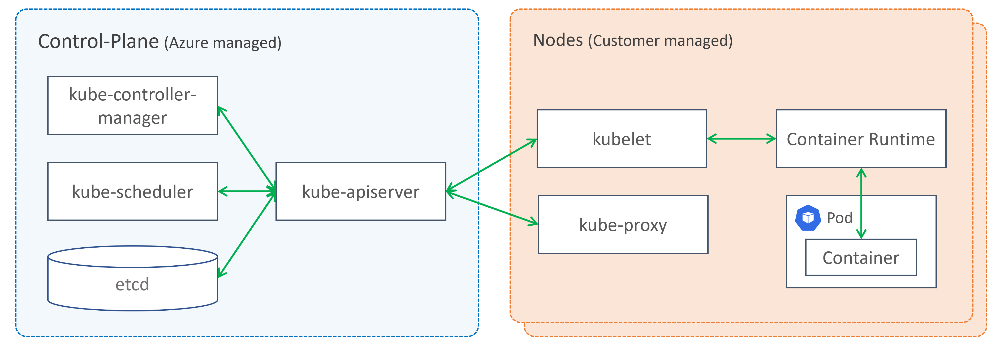
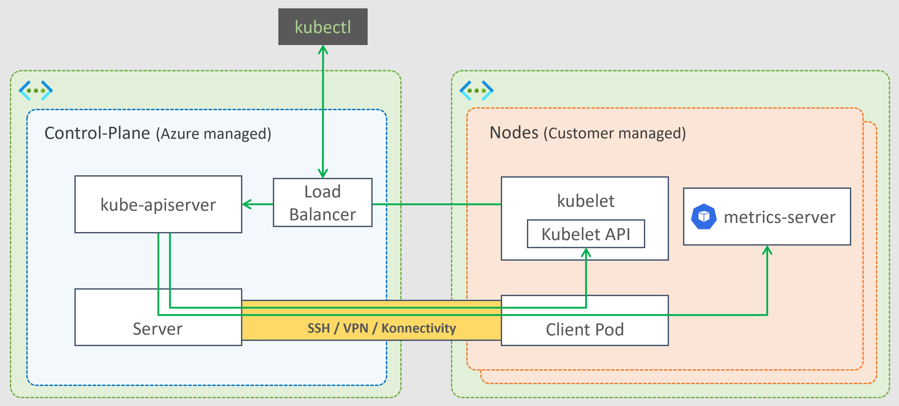

この記事は [Microsoft Azure Tech Advent Calendar 2021](https://qiita.com/advent-calendar/2021/microsoft-azure-tech) の 24 日目の記事になります🎅

こんにちは！！ Azure テクニカル サポート チームの桐井です。

AKS クラスターをデプロイすると、kube-system ネームスペースで `tunnelfront` や `aks-link` という名前の Pod が動いているかとおもいます。あるいは `konnectivity-agent` という Pod を見たことがあるという方もいるかもしれません。これらの Pod はどのような目的で使用されるのでしょう？

本記事では、これらのシステム Pod が担う AKS コントロール プレーンとノード間の通信について紹介します。

<!-- more -->

---

## Kubernetes クラスターのアーキテクチャ

まずは説明にあたり、前提情報となる Kubernetes のアーキテクチャについて簡単に紹介いたします。Kubernetes のクラスターは、大きく分けて **コントロール プレーン** と **ノード** の 2 つのコンポーネントで構成されています。

### コントロール プレーン
Kubernetes の主要なサービスが稼働しており、アプリケーション ワークロードのオーケストレーションを担います。コントロール プレーンでは API サーバー (kube-apiserver) が存在し、クラスターの操作を [Kubernetes API](https://kubernetes.io/ja/docs/concepts/overview/kubernetes-api/) として提供します。

### ノード
コンテナー化されたアプリケーション ワークロードが実行されます。各ノードでは kubelet が動作しており、Pod のデプロイ内容に基づいてコンテナー ランタイムを操作したり、Node や Pod のステータスを API サーバーへ送信したりといった処理を行います。

Azure Kubernetes Service (AKS) は、Kubernetes コントロール プレーンを Azure のマネージド リソースとして提供するサービスとなっています。クラスターのアーキテクチャの詳細につきましては、下記 AKS ドキュメントをあわせてご参照ください。

> ご参考) Azure Kubernetes Services (AKS) における Kubernetes の中心概念
> https://docs.microsoft.com/ja-jp/azure/aks/concepts-clusters-workloads

## コントロール プレーンとノード間の通信

前述のように、クラスターの各種操作は Kubernetes API を介して行われます。クラスターの利用者が実行する kubectl コマンドや、ノード上で稼働する kubelet は、コントロール プレーンの API サーバー (kube-apiserver) にアクセスして、リソース操作や情報取得のリクエストを行います。

実際のアプリケーション ワークロードは、コントロール プレーンではなくノード側で動作しています。そのため、API サーバーはリクエストされたクラスター操作を実現するために、ノードや Pod との通信をする必要があります。

API サーバーとノードの通信は大きく 2 つにわけることができます。

### (1) ノードから API サーバー

API サーバーは HTTPS ポート (443) で Kubernetes API を公開しています。
kubelet や、Ingress Controller などの Kubernetes API を利用する Pod は、API サーバーのエンドポイントに HTTPS でアクセスをし、各種リソース情報の取得や更新を行います。

### (2) API サーバーからノード

一部のクラスター操作には、API サーバーから [kubelet が持つ API エンドポイント](https://kubernetes.io/docs/reference/ports-and-protocols/#node)に対してリクエストを送信し、その結果を取得する処理が必要になります。

* Pod からログを取得する (kubectl logs)
* Pod 上でコマンドを実行する (kubectl exec)
* Pod / Service にポート フォワードで接続する (kubectl port-forward)

また、[Metrics API](https://kubernetes.io/docs/tasks/debug-application-cluster/resource-metrics-pipeline/) へのアクセス (kubectl top) では、Node や Pod のリソース使用量を取得するために、ノード側で動作する [metric-server](https://github.com/kubernetes-sigs/metrics-server) へのアクセスが必要となります。

これらの機能の実現をするために、API サーバーは kubelet や Pod / Service にアクセスする必要があるため、コントロール プレーンからノードへの通信経路が必要となります。

## コントロール プレーンからノードへの通信の実現方法

冒頭で挙げたシステム Pod は、コントロール プレーンからノードへの通信を実現するために仮想的なネットワーク経路を作るクライアント Pod となっています。

これらのコンポーネントは Kubernetes のアーキテクチャ図には載っておらず、あまり聞き馴染みのない Pod かと思います。自分で仮想マシンを使って Kubernetes クラスターの構築 ([Kubernetes Hard Way](https://github.com/kelseyhightower/kubernetes-the-hard-way)) を試したことがある方は、そのような Pod をインストールしたかな？と疑問に思うかもしれません。

コントロール プレーンとノードが同じネットワークに接続している場合は、kube-apiserver はノードや Pod に直接通信できます。ところが、コントロールプレーンとノードが異なるネットワークに存在し分断されている場合は、そのままではお互いに通信ができないので、何らかの方法でネットワーク経路を作り、通信ができるようにする必要があります。また、信頼できないネットワークやパブリック ネットワークを経由させる場合には、盗聴や中間者攻撃を防ぐためにネットワークの保護も必要です。

パブリック クラウドの Kubernetes サービスでは、コントロールプレーンをマネージド サービスとして提供するため、ノードが存在しているお客様の環境とは別のネットワークが使用されます。そのため、SSH トンネルや VPN といった技術を使って、API サーバーとノード間で仮想的なネットワーク経路が作られる構成になっています。

コントロール プレーンとノード間のネットワーク接続には、いくつかの実現方法がございます。ここでは、AKS で利用されている通信方式と、各方式において kube-system ネームスペースにデプロイされるシステム Pod の名前を紹介いたします。クラスターの構成や作成時期によって、以下のいずれかの方式が利用されます。

### SSH トンネル (tunnelfront-* Pod)

`tunnelfront` という名前の Pod が存在するクラスターでは、SSH トンネルが使用されています。コントロール プレーン側には SSH サーバーが存在し、API サーバーのエンドポイントで SSH クライアントからの接続を受け付けています。`tunnelfront` Pod は SSH クライアントとなっており、コントロール プレーンとノード間で SSH トンネルを開始します。kubelet や Pod / Service 宛てのトラフィックは SSH トンネル経由で転送されます。

### VPN トンネル (aks-link-* Pod)

`aks-link` という名前の Pod が存在する場合は、VPN トンネル (OpenVPN) が使用されています。コントロール プレーン側には VPN サーバーが存在します。ノード側の `aks-link` Pod が VPN クライアントとなっており、コントロール プレーンとノード間で VPN トンネルを開始します。

### Konnectivity (konnectivity-agent-* Pod)

`konnectivity-agent` という名前の Pod が存在する場合には [Konnectivity service](https://kubernetes.io/docs/concepts/architecture/control-plane-node-communication/#konnectivity-service) が使用されています。Konnectivity はアップストリームの Kubernetes プロジェクトで[開発されている](https://github.com/kubernetes-sigs/apiserver-network-proxy) TCP レベルのプロキシーです。コントロール プレーン側では Konnectivity Server が起動し、ノード側では Konnectivity Agent が起動します。

AKS では SSH / VPN トンネルに替わる新しい方式として、段階的に Konnectivity の導入がすすめられています。[Release 2021-10-28](https://github.com/Azure/AKS/releases/tag/2021-10-28) で一部リージョンからロールアウトが開始されましたが、[Release 2021-11-18](https://github.com/Azure/AKS/releases/tag/2021-11-18) 以降、2021 年の残りの期間ではロールアウトが中断となっています。そのため、日本リージョンで利用可能になるのはもう少し先になる見込みです。

> [!TIP]
> 余談: 「コネクティビティ」というと英語の「connectivity」と紛らわしいので「Konnectivity with K」と呼ばれることがあります。

## トラブルシューティングの事例

コントロール プレーンとノードの通信については、関連するトラブルのご相談を Azure サポートにお寄せいただくことがございます。多く寄せられるご相談としましては、Kubernetes の一部機能が利用できないという事象です。

* Pod 上でコマンド実行ができない (kubectl exec)
* Pod のログ取得ができない (kubectl logs)
* port-forward ができない (kubectl port-forward)
* Pod や Node のメトリックが取得できない (kubectl top)

Pod の作成/削除といったリソース操作は成功するものの、上記に挙げましたように kubectl の一部コマンドが使えないという症状がある場合は、何らかの要因でコントロール プレーンとノード間の通信が成功していないことが考えられます。

> ご参考) Azure Kubernetes Service (AKS) についてよく寄せられる質問
> [「kubectl logs を使用してログを取得できません。または、API サーバーに接続できません。 "Error from server: error dialing backend: dial tcp…" (サーバーからのエラー: バックエンドへのダイヤルでのエラー: tcp にダイヤル...) と表示されます。 どうすればよいですか。」](https://docs.microsoft.com/ja-jp/azure/aks/troubleshooting#i-cant-get-logs-by-using-kubectl-logs-or-i-cant-connect-to-the-api-server-im-getting-error-from-server-error-dialing-backend-dial-tcp-what-should-i-do)
> https://docs.microsoft.com/ja-jp/azure/aks/troubleshooting#i-cant-get-logs-by-using-kubectl-logs-or-i-cant-connect-to-the-api-server-im-getting-error-from-server-error-dialing-backend-dial-tcp-what-should-i-do

この事象が発生しました場合は以下の観点をご確認ください。

### (観点 1) クラスターに必要な通信要件を満たしているか

API サーバーへの通信が NSG や Azure Firewall によってブロックされていないかを確認します。

下記 AKS ドキュメントに、クラスターの動作に必要なエンドポイントとポート番号の一覧がございます。ご利用の環境に応じて、通信が必要な FQDN / ポート番号の許可がされているかをご確認ください。

> ご参考) Azure Kubernetes Service (AKS) でクラスター ノードに対するエグレス トラフィックを制御する
> [AKS クラスターに必要な送信ネットワーク規則と FQDN](https://docs.microsoft.com/ja-jp/azure/aks/limit-egress-traffic#required-outbound-network-rules-and-fqdns-for-aks-clusters)
> https://docs.microsoft.com/ja-jp/azure/aks/limit-egress-traffic#required-outbound-network-rules-and-fqdns-for-aks-clusters

### (観点 2) kube-system ネームスペースのシステム Pod が正常動作しているか

kube-system ネームスペース内のシステム Pod が正常に動作しているかを確認します。

本記事で紹介をいたしました `tunnelfront` や `aks-link` といったシステム Pod が Running ステータスで動作をしているか、また、Pod のログに何らかのエラー メッセージが出力されていないかをご確認ください。詳細につきましては下記の AKS トリアージ ガイドをご参照ください。

> ご参考) AKS トリアージのプラクティス - ノードとポッドの正常性を調べる
> [2 - コントロール プレーンとワーカー ノードの接続を確認する](https://docs.microsoft.com/ja-jp/azure/architecture/operator-guides/aks/aks-triage-node-health#2--verify-the-control-plane-and-worker-node-connectivity)
> https://docs.microsoft.com/ja-jp/azure/architecture/operator-guides/aks/aks-triage-node-health#2--verify-the-control-plane-and-worker-node-connectivity

API サーバーとの通信に問題がある場合、`kubectl logs` が成功せず、Pod のログ確認ができないことが想定されます。[Container Insights](https://docs.microsoft.com/ja-jp/azure/azure-monitor/containers/container-insights-overview) が有効なクラスターでは、クラスター内の監視エージェント (omsagent) によって収集されたログが、Log Analytics ワークスペースから取得出来る場合がございます。kubectl コマンドでのログ取得が成功しない場合は、[クエリーを使用した Log Analytics からのログ取得](https://docs.microsoft.com/ja-jp/azure/azure-monitor/containers/container-insights-log-query)をお試しください。

上記をご確認いただいたあとも引き続き事象が発生します場合は、Azure サポートまでお気兼ねなくご相談ください。クラスターの状態を拝見させていただき、見解・対処方法をご案内いたします。

## さいごに

Kubernetes コントロール プレーンとノード間の通信と、AKS における通信方式、そしてトラブルシューティングの事例について紹介しました。

本記事で紹介しました Konnectivity は段階的に各リージョンへロールアウトされる見込みです。最新の情報につきましては、AKS の GitHub リポジトリにございますリリース情報をご参照ください。

> ご参考) Azure/AKS - Releases
> https://github.com/Azure/AKS/releases

本稿が皆様のお役に立ちましたら幸いです。

### 参考リンク

* [Control Plane-Node Communication - Kubernetes](https://kubernetes.io/docs/concepts/architecture/control-plane-node-communication/)
* [Set up Konnectivity service - Kubernetes](https://kubernetes.io/docs/tasks/extend-kubernetes/setup-konnectivity/)
* [kubernetes / enhancements - API Server Network Proxy](https://github.com/kubernetes/enhancements/tree/master/keps/sig-api-machinery/1281-network-proxy)

---

最後まで読んでいただきありがとうございました！
[Microsoft Azure Tech Advent Calendar 2021](https://qiita.com/advent-calendar/2021/microsoft-azure-tech) は明日が最終日となります！是非ご覧くださいー！
