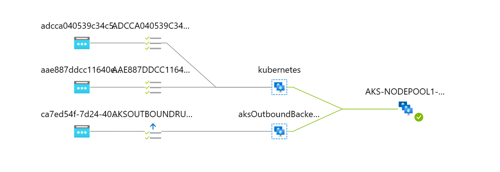
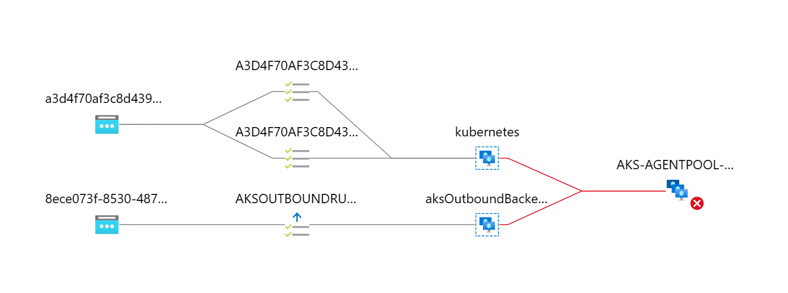
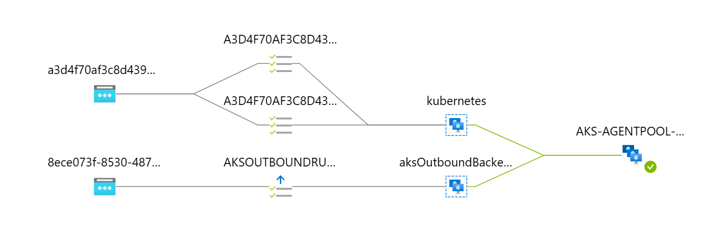
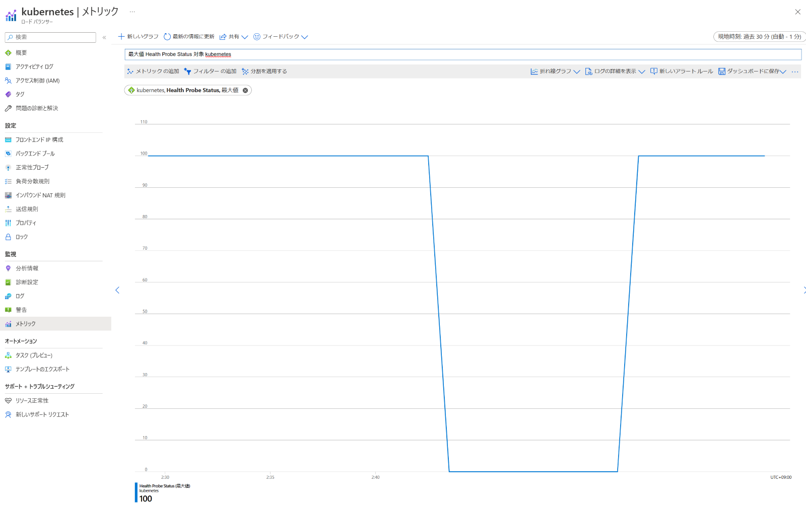

こんにちは。Azure テクニカル サポートチームの小沢です。 

AKS の Kubernetes バージョンを 1.24 へアップグレードをした際に、Azure Load Balancer の正常性プローブがTCPプロ―ブから HTTP/HTTPS プローブに変更されることがあります。 
本記事では、プローブの構成が変更された理由と影響、および対応方法について紹介します。 

<!-- more --> 

--- 

## Azure Load Balancer正常性プローブ 

AKS クラスターに Type LoadBalancer の Service を作成すると、自動的に Azure Load Balancer に負荷分散規則が構成され、バックエンドには AKS ノードが割り当てられます。 
また、Load Balancer のヘルスチェック機能である正常性プローブが構成されます。 

正常性プローブは、一定の間隔でバックエンドの VM インスタンスに対してヘルスチェック用のアクセスをします。 
ヘルスチェックのアクセスが、プローブに設定された回数成功しなかった場合は、バックエンドが異常とみなされ、異常なバックエンドにはリクエストが送信されなくなります。 
正常性プローブで利用できるプロトコルには、TCP、HTTP、HTTPSの3つがあります (Load Balancer の SKU が Standardの場合)。 
正常性プローブで利用可能なプロトコルの種類や動作につきましては、以下のドキュメントをご参照ください。 

  > ご参考) Azure Load Balancer の正常性プローブ 
  > https://learn.microsoft.com/ja-jp/azure/load-balancer/load-balancer-custom-probe-overview 

## Service (Type LoadBalancer) に設定される正常性プローブ 

AKS 上で Service (Type LoadBalancer) を作成した場合には、Service オブジェクトに設定された値に基づいて、Azure Load Balancer の正常性プローブが自動的に構成されます。 

正常性プローブで使用するプロトコルは、Service の `spec.portsAppProtocol` フィールドの設定値 (tcp, http, https) が使用されます。 
また、プロトコルが http/https の場合、`service.beta.kubernetes.io/azure-load-balancer-health-probe-request-path` アノテーションで指定されたパスに対して、正常性プローブのリクエストが送信されます。 
`spec.portsAppProtocol` が設定されていない場合は、アノテーションによるリクエスト パスの指定は無視され、tcp プロトコルを使用する正常性プローブが構成されます。 

Kubernetes バージョン 1.24以降では、Service のアノテーション `service.beta.kubernetes.io/azure-load-balancer-health-probe-request-path` が設定されて**いない場合**に、正常性プローブの既定の構成が変更されました。 
Kubernetes バージョン 1.23 以前と 1.24 以降では、次のような違いがあります。 

- Kubernetes バージョン <= 1.23 の場合 
  - Service のアノテーションが設定されていない場合、**プローブのプロトコルに TCP が使用されます** 
  - アノテーションが設定されている場合は、プロトコルは `spec.ports.appProtocol` (http/https) が使用され、アノテーションで指定されたパスにプローブのリクエストが送信されます 
- Kubernetes バージョン > 1.24 の場合 
  - Service のアノテーションが設定されていない場合、**プローブのプロトコルに `spec.ports.appProtocol` (http/https) が使用され、リクエスト パスには `/` が使用されます** 
  - アノテーションが設定されている場合は、プロトコルは `spec.ports.appProtocol` (http/https) が使用され、アノテーションで指定されたパスにプローブのリクエストが送信されます 

Load Balancer の正常性プローブで、どのプロトコルとリクエスト パスが使用されるかについては、Cloud Provider Azure のドキュメントで確認できます。 

> ご参考) Cloud Provider Azure - Custom Load Balancer health probe 
> https://cloud-provider-azure.sigs.k8s.io/topics/loadbalancer/#custom-load-balancer-health-probe 

## 正常性プローブの構成が変更された場合の影響 

Service (type: LoadBalancer) の YAML マニフェストにおいて、Service のアノテーション `service.beta.kubernetes.io/azure-load-balancer-health-probe-request-path` を記述せずに、`spec.ports.appProtocol` のみを記述している場合に、Kubernetes バージョンをアップグレードしたあとにアプリケーションへアクセスできない事象が発生する可能性があります。 

Kubernetes <= 1.23 では、`spec.ports.appProtocol` にプロトコル名が記述されている場合でも、正常性プローブのプロトコルには TCP が使用されます。 
TCP プローブでは、対象の TCP ポートへの疎通性のみをチェックします。 
HTTP/HTTPS のリクエスト/レスポンスの成否や、レスポンスの内容 (エラーステータスであるかどうか) は、プローブの結果に影響をしません。 

一方 Kubernetes > 1.24 では、`spec.ports.appProtocol` に `http (または　https)`が記述されていると、正常性プローブのプロトコルは `http (または https)` に設定されます。 
また、アノテーションでプローブのリクエスト パスが設定されていない場合には、既定で `/` が使用されます。 
AKS クラスターで稼働しているアプリケーションが、`/` のパスでリクエストを受け付けていない場合や、`/` にアクセスした結果、エラーステータスの HTTP レスポンスを返した場合には、正常性プローブが失敗します。 

このように、Kubernetes バージョンによって、正常性プローブで使用されるプロトコルとパスが異なります。 

Kubernetes 1.23 では、TCP プロトコルによる疎通チェックによって正常性プローブが成功していたものの、Kubernetes 1.24 にアップグレードしたあとに正常性プローブが HTTP(S) によるチェックに切り替わり、プローブの条件を満たさなくなったことでバックエンドから切り離され、Load Balancer を介したアプリケーションへのアクセスが成功しない事象が発生します。 

 
## 事例: NGINX Ingress Controller にアクセスできなくなる 

NGINX Ingress Controller を使用しているクラスターで、Kubernetes バージョンのアップグレードを実施したあとに、本事象の影響を受ける場合があります。 

NGINX Ingress Controller では、Ingress でマッピングされていないリクエストは、全て default backend で処理されます。 
default backend は2つのパスを公開しており、`/healthz` では HTTP 200 ステータスを返し、`/` は HTTP 404 ステータスを返します。 

> ご参考) NGINX Ingress Controller - Default backend 
> https://kubernetes.github.io/ingress-nginx/user-guide/default-backend/ 

Kubernetes 1.23 では、正常性プローブは TCP プロトコルによる疎通チェックのみを行います。 
そのため、Ingress Controller に用意されているパスや、そのレスポンス内容にかかわらず、TCP ポートに到達できる状態であれば、正常性プローブが成功します。 
しかし、Kubernetes 1.24 では、`spec.ports.appProtocol` が `http/https` の場合、正常性プローブは既定で `/` へリクエストを送信し、その HTTP レスポンスの結果によってプローブの結果を決定します。 
default backend の `/` は HTTP 404 ステータスを返すために、正常性プローブは失敗の状態となり、Load Balancer からバックエンドの AKS ノードにトラフィックが流されなくなるために、アプリケーションへアクセスできなくなる事象が発生します。 

NGINX Ingress Controller の Helm Chart では、既定で Service の `spec.ports.appProtocol` を出力するように values.yaml が構成されています。 
一方、Service のアノテーションは `annotations: {}` のように、値が空となっていいます。 

> https://github.com/kubernetes/ingress-nginx/blob/f90f37bed66d343e6c57ea981d6c4e90e4955975/charts/ingress-nginx/values.yaml#L460-L468 
> https://github.com/kubernetes/ingress-nginx/blob/f90f37bed66d343e6c57ea981d6c4e90e4955975/charts/ingress-nginx/templates/controller-service.yaml#L53-L71 

そのため、Kubernetes 1.23 以前に NGINX Ingress Controller をインストールしていた場合には、Kubernetes 1.24 にアップグレードする前に、Ingress Controller の Service に対して、プローブのリクエスト パスが `/heathz` になるように、事前にアノテーションを追加しておく必要があります。 

## NGINX Ingress Controller にアクセスできない事象の再現 

実際に、Kubernetes 1.23 の AKS クラスターに NGINX Ingress Controller をインストールして、その後 Kubernetes 1.24 へアップグレードすることで、本事象の影響を確認します。 

まず ingress-nginx-controller Service の YAML マニフェストの内容を確認します。 
`metadata.annotations` に `service.beta.kubernetes.io/azure-load-balancer-health-probe-request-path` の設定がなく、`spec.ports.appProtocol` では `http/https` が使用されていることが確認できました。 

```yaml 
$ kubectl get svc ingress-nginx-controller -o yaml -n ingress-basic 
apiVersion: v1 
kind: Service 
metadata: 
  annotations: 
    # リクエスト パスのアノテーションがない 
    meta.helm.sh/release-name: ingress-nginx 
    meta.helm.sh/release-namespace: ingress-basic 
    … 
spec: 
　… 
  ports: 
  - appProtocol: http       # http が指定されている 
    name: http 
    nodePort: 32271 
    port: 80 
    protocol: TCP 
    targetPort: http 
  - appProtocol: https      # https が指定されている 
    name: https 
    nodePort: 30569 
    port: 443 
    protocol: TCP 
    targetPort: https 
``` 

AKS クラスターで使用される Azure Load Balancer のリソースは、kubernetes という名前で、ノードリソースグループ (既定では MC_* という名前) に配置されています。 
Azure Portal で Load Balancer を開き、左メニューの正常性プローブのページを開きます。 
プローブの一覧を確認すると、プロトコル がTCP のプローブとなっていることがわかります。 


また、左メニューの分析情報のページを開くと、ネットワーク構成の図が表示され、正常性プローブは成功していることが確認できます。 



そのあと、対象の AKS クラスターの Kubernetes バージョンを 1.24 にアップグレードします。 
アップグレードをした後に Azure Portal 画面から正常性プローブを確認すると、プロトコルが `HTTP/S` のプローブが作成されており、リクエスト パスが `/` に設定されていることが確認できました。 
この場合、NGINX Ingress Controller の default Backend は、`/` に対するアクセスに HTTP 404 ステータスを返すため、正常性プローブが失敗してしまいます。 


 
Azure Portal画面の分析情報の図からも、正常性プローブが失敗していることが確認できます。 

 

## 対応方法 

Kubernetes 1.24 のクラスターで、正常性プローブの状態を回復させる対応方法について説明します。 

> [!IMPORTANT]
> AKS で使用される Load Balancer の正常性プローブは、 クラスター上に作成された Service の内容をもとに、自動的に構成される仕組みです。 
> そのため、Azure CLI や Azure Portal で Load Balancerを直接変更するのではなく、Service の設定値を変えます。 

Service にアノテーションを追加し、カスタム ヘルスプローブ パスを設定することで、Kubernetes 1.23 から 1.24 へアップグレードした際にも正常性プローブが成功します。 

```yaml 
# Service にアノテーションを設定する例 
apiVersion: v1 
kind: Service 
metadata: 
  annotations: 
    service.beta.kubernetes.io/azure-load-balancer-health-probe-request-path: /healthz  # HTTP 200 ステータスを返すパスを指定します 
… 
``` 

Helm を使ってインストールした NGINX Ingress Controller は、`helm upgrade` コマンドで Service のアノテーションが設定できます。 
`helm ugprade` コマンドに `--set` オプションを付与し、`controller.service.annotations` value の値を `"service.beta.kubernetes.io/azure-load-balancer-health-probe-request-path"=/healthz` に設定します。 

すでに Kubernetes 1.24 にアップグレードしたクラスターや、これからアップグレードをするクラスターでは、`helm upgrade` コマンドでアノテーションを設定しましょう。 
また、この `--set` オプションは、新規に Ingress Controller をインストールする際にも、`helm install` コマンドに付与することで利用できます。 
今後新規に Ingress Controller をインストールする場合には、オプションでアノテーションの値を指定したうえで、インストールしましょう。 

```bash 
helm upgrade ingress-nginx ingress-nginx/ingress-nginx \ 
  --create-namespace \ 
  --namespace $NAMESPACE \ 
  --set controller.service.annotations."service\.beta\.kubernetes\.io/azure-load-balancer-health-probe-request-path"=/healthz 
Release "ingress-nginx" has been upgraded. Happy Helming! 
NAME: ingress-nginx 
LAST DEPLOYED: Mon Jan 16 15:16:54 2023 
NAMESPACE: ingress-basic 
STATUS: deployed 
REVISION: 2 
TEST SUITE: None 
NOTES: 
The ingress-nginx controller has been installed. 
It may take a few minutes for the LoadBalancer IP to be available. 
You can watch the status by running 'kubectl --namespace ingress-basic get services -o wide -w ingress-nginx-controller' 
``` 

Service の YAML マニフェストの内容を確認してみましょう。 
`metadata.annotations` フィールド内に、`service.beta.kubernetes.io/azure-load-balancer-health-probe-request-path: /healthz` が追加されたことを確認できました。 

```yaml 
$ kubectl get svc ingress-nginx-controller -o yaml -n ingress-basic 
apiVersion: v1 
kind: Service 
metadata: 
  annotations: 
    meta.helm.sh/release-name: ingress-nginx 
    meta.helm.sh/release-namespace: ingress-basic 
    service.beta.kubernetes.io/azure-load-balancer-health-probe-request-path: /healthz 
  ... 
spec: 
　... 
  ports: 
  - appProtocol: http 
    name: http 
    nodePort: 32271 
    port: 80 
    protocol: TCP 
    targetPort: http 
  - appProtocol: https 
    name: https 
    nodePort: 30569 
    port: 443 
    protocol: TCP 
    targetPort: https 
``` 

Azure Portal の画面上でも、プローブのリクエスト パスが `/` から `/healthz` に変わりました。 

 

また、分析情報の画面においても、正常性プローブも成功していることが確認できました。 



このように、`HTTP/HTTPS` プローブのリクエスト先を、`/` (404 ステータスが返される) から、`/healthz` (200 ステータスが返される) に変更することで、正常性プローブの状態を回復させることが確認できました。 

今回は NGINX Ingress Controller を例に説明をしたため、リクエスト パスは `/healthz` を指定しました。 
アプリケーションが用意するヘルスチェック用のエンドポイントは、アプリケーションの実装によってエンドポイントの有無や名称が異なる場合がございます。 
トラブルシューティングの際は、対象のアプリケーションの仕様・実装をご確認いただき、リクエスト パスをご指定ください。 

## 正常性プローブが失敗した時のトラブルシューティング 

さいごに、正常性プローブが成功しない場合の、一般的なトラブルシューティング観点について紹介します。 

### 1. ノードの VM インスタンスが起動しているか？ 

Load Balancer の正常性プローブは、バックエンドプールのインスタンスの状態を監視しています。 
インスタンスが起動していない場合にはヘルスチェックのリクエストが成功しないことが想定されますので、プローブの失敗を検知した際は、VM インスタンスが正常に起動しているかを確認します。 
AKS では、ノードのステータスが NotReady となっていないかをあわせて確認しましょう。 

### 2. NodePort および正常性プローブのリクエスト パス 

Load Balancer の正常性プローブが、AKS に作成した Service の設定値と一致しているかを確認します。 
本記事で上述したように、プローブで利用するプロトコルと、プローブのリクエスト パスが正しいかを確認しましょう。 

また、type LoadBalancer の Service を作成すると、各ノードに NodePort のポートが設定されます。ポート番号は既定で 30000-32767 の範囲となります。 
Kubectl get svc コマンドで Service 名と NodePort のポート番号を確認し、プローブのリクエスト先と一致しているかを確認しましょう。 

### 3. Service の Selector と Pod の label 

Service で指定している selector が、Pod に設定されている label と一致しているかを確認します。 
また、selector/label が一致している場合は、Pod が正常に稼働しているかどうかを確認します。 

### 4. Load Balancer からの正常性プローブの通信をブロックしていないかどうか 

正常性プローブの設定に問題がなく、ノードや Pod が起動しているにもかかわらず、正常性プローブが失敗している場合には、Load Balancer から送信された正常性プローブの通信がブロックされている可能性が考えられます。 

NetworkPolicyなどでネットワーク通信を制限している場合には、Load Balancer からの正常性プローブの通信 (送信元が 168.63.129.16) をブロックしていないか確認します。 

> ご参考) Azure Load Balancer の正常性プローブの状態に関するトラブルシューティング 
> 「原因 3:ファイアウォール、またはネットワーク セキュリティ グループが Load Balancer バックエンド プール VM 上のポートをブロックしている」をご参照ください。 
> https://learn.microsoft.com/ja-jp/azure/load-balancer/load-balancer-troubleshoot-health-probe-status 

また、Azure Portal の画面では、Load Balancerのメトリックで、正常性プローブの状態を確認することができます。 
`Health Probe Status` メトリックの値から、過去の正常性プローブの状態を確認できますので、事象の発生や解消のタイミングを確認する際にご活用ください。 



## さいごに 

この記事では、AKS の Kubernetes バージョンを 1.24 にアップグレードした際に、Load Balancer Service の正常性プローブが成功しなくなる事象と、その対処方法について解説しました。 
Kubernetes バージョンのアップグレード作業や、Load Balancer サービスへのアクセスが成功しない場合のトラブルシューティングのご参考にいただけますと幸いでございます。 

本稿が少しでも皆様のご参考となれば幸いです。 