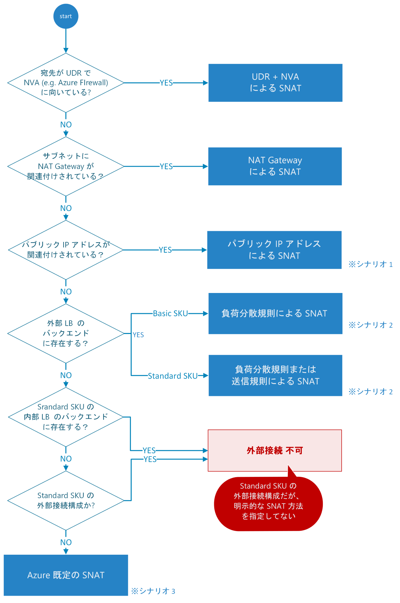
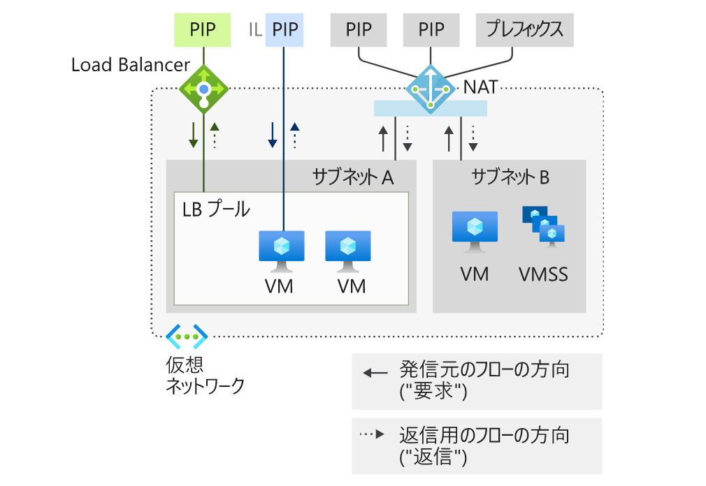
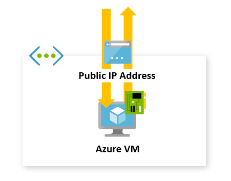
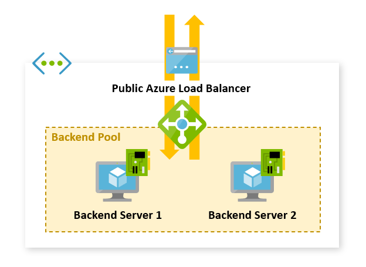
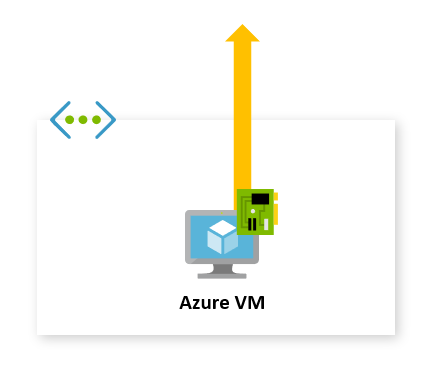

Azure Networking テクニカル サポートの山口です。

Azure VM がインターネットに接続する際には、パブリック IP アドレスでの送信元 NAT (SNAT) が必要です。Azure は、外部接続の SNAT に関して多くのオプションを提供していますが、オプションが多くて便利な反面、全オプションの列挙やオプション間の比較が難しいのも事実です。そうした難しさを少しでも緩和できるよう、本稿では外部接続の SNAT オプションを様々な角度から網羅的に紹介いたします。

<!-- more -->

## はじめに

**仮定する知識**

この記事では、一般的なネットワーク用語としてのネットワーク アドレス変換 (NAT) や NAPT について、ある程度知識があることを前提としています。これらの言葉に馴染みがなければ、以下の公式ドキュメントを参考に、まずは NAT についての技術背景を確認してみてください。インターネットを活用すれば、さらに多くの技術解説を見つけることが出来るはずです。

* [Azure の Outbound connections > SNAT と PAT の理解 | Microsoft Docs](https://docs.microsoft.com/ja-jp/azure/load-balancer/load-balancer-outbound-connections#understanding-snat-and-pat)

**外部接続と SNAT**

Azure 仮想マシン (VM) がインターネット等のグローバル IP アドレス帯のサーバーと通信することを、**外部接続 (outbound connection)** と呼びます。外部接続では、仮想ネットワークで設定したプライベート IP アドレスから、グローバル IP アドレスに送信元 NAT (SNAT) する必要があります。この記事で取り扱うのは、外部接続の為に Azure が提供している SNAT のオプションについてです。

結論から書くと、2020 年 6 月現在、Azure で利用できる SNAT のオプションは以下の 5 つ存在します。

* ユーザー定義ルートと仮想アプライアンス (e.g. Azure Firewall) による SNAT
* NAT Gateway
* パブリック Azure Load Balancer (外部ロードバランサー)
* パブリック IP アドレス
* Azure 既定の SNAT

「ユーザー定義ルート (UDR) と仮想アプライアンス (NVA) による SNAT」に関しては、SNAT 可否やその動作仕様が NVA 製品に依存しますので、今回は残る 4 つの「Azure プラットフォームそのものが提供する SNAT」についてお話します (UDR+NVA で SNAT する場合も、結局 NVA 上では残りのいずれかの方法で SNAT する必要があります)。

## 判定フローチャート

個々の詳細を見る前に、SNAT オプション同士の依存関係を把握し、全体感を捉えておきましょう。

というのも、環境によっては複数の SNAT オプションが構成されている可能性がある為です。例えば、NAT Gateway を関連付けたサブネットの中に、パブリック IP アドレスを付与した VM をデプロイするとどうなるでしょうか?

そのような状況で役に立つフローチャートを作図しました。以下のフローに従えば、**ある Azure VM のある NIC** がどのように SNAT されるか判定できます。VM ではなく、NIC に関する SNAT 方法判定である点に注意してください。

なお、フローチャートに脚注で記載されているシナリオ {1, 2, 3} は、以下の公式ドキュメントのシナリオ番号に対応しています。

* [Azure の Outbound connections - Azure Load Balancer | Microsoft Docs](https://docs.microsoft.com/ja-jp/azure/load-balancer/load-balancer-outbound-connections#scenario-overview)

**フローチャートの使い方**

先程挙げた NAT Gateway とパブリック IP アドレスの共存環境の例を使って、フローチャートの使い方を説明します。

1. 左上の丸からスタートします。
2. まずはじめに、UDR で宛先が NVA に向いているか確認します。この情報は、NIC の [有効なルート] から確認することが出来ます。この例では NVA もルート テーブルもデプロイしておらず、判定は "NO" だったとして次の条件文に進みます。
3. サブネットに NAT Gateway が関連付けられているか確認します。この情報は、仮想ネットワークの [サブネット] から確認することが出来ます。この例では NAT Gateway が関連付けられています! 条件文の答えは "YES" なので、フローチャートはここで終了します。

最終的に、パブリック IP アドレスではなく NAT Gateway が優先されて SNAT される動作であることが、このフローチャートから判定出来ました。

**Standard SKU の外部接続構成か?**

最後の「Standard SKU の外部接続構成か?」と記載された条件ボックスは、次のいずれか一つを満たす場合に "YES" と判定されます。

- VM には可用性セットが構成されていて、一つ以上の可用性セット内 VM が「Standard SKU の外部接続リソース」に関連付けられている。
- VM は仮想マシン スケール セット (VMSS) であり、一つ以上の VMSS 内 VM が「Standard SKU の外部接続リソース」に関連付けられている。
- 複数の NIC が VM に関連付けられていて、一つ以上の NIC が「Standard SKU の外部接続リソース」に関連付けられている。

ここで、Standard SKU の外部接続リソースとは、以下の Azure リソースを表します。

- Standard SKU のパブリック IP アドレス
- Standard SKU の Azure Load Balancer

上記の通り、NAT Gateway は "Standard SKU の外部接続リソース" に該当しないため、可用性セットの一部 VM にだけ外部接続を構成したい場合や、複数 NIC を持つ VM の一部 NIC に外部接続を構成したい場合に使えます。

このあたりの条件式を把握するのは難しく、個人的にも理解するのに最も時間がかかった部分ですが、 **Standard SKU ではリソースの保護が強化されていて、明示的に通信設定をするまでは許可されない** と理解すれば多少は飲み込みやすいと思います。同じ内容は、以下の公式ドキュメントにも記載されています。

* [Azure の Outbound connections - Azure Load Balancer | Microsoft Docs](https://docs.microsoft.com/ja-jp/azure/load-balancer/load-balancer-outbound-connections)

> 重要
> ...
> アウトバウンド接続のコンテキストでは、単一スタンドアロン VM、可用性セット内のすべての VM、VMSS のすべてのインスタンスがグループとして動作します。 つまり、可用性セット内の単一 VM が Standard SKU に関連付けられている場合、この可用性セット内のすべての VM インスタンスが、Standard SKU に関連付けられている場合と同じ規則に従って動作するようになります。個々のインスタンスが直接関連付けられていない場合でも同様です。 この動作は、ロード バランサーに複数のネットワーク インターフェイスカードが接続されているスタンドアロン VM の場合にも見られます。 1 つの NIC をスタンドアロンとして追加された場合、同じ動作が行われます。

**外部接続不可**

最後に、フローチャートの中で赤色で記された「外部接続不可」のシナリオについて補足しておきます。

フローチャートからもわかるように、Azure では多くの SNAT オプションがあり、ほとんどの状況で外部接続が可能です。特に、NAT 装置を意識せずに VM をデプロイするだけでも (デフォルトゲートウェイが) SNAT を実施してくれる「Azure 既定の SNAT」のシナリオに関しては、特筆すべきポイントです。

しかしながら、一つだけ SNAT 出来ないシナリオがあります。それが「外部接続不可」のシナリオです。具体的には、Standard SKU の外部接続構成の NIC に、明示的に外部接続リソースを関連付けない場合に該当します (こうして言葉で説明するより、フローチャートを見てもらうほうが早いと思います)。

「VM が外部接続できない、できなくなった」というお問い合わせは多数いただきますが、殆どの場合の根本原因は、単に「外部接続不可」のシナリオに該当していたというものです。このため、過去にもブログ記事として紹介しています。

* [Azure ロードバランサー利用時の注意点 > ロードバランサーのバックエンドプールに追加したら外部へ接続できなくなった](https://jpaztech1.z11.web.core.windows.net/Azure%E3%83%AD%E3%83%BC%E3%83%89%E3%83%90%E3%83%A9%E3%83%B3%E3%82%B5%E3%83%BC%E5%88%A9%E7%94%A8%E6%99%82%E3%81%AE%E6%B3%A8%E6%84%8F%E7%82%B9.html#outbound-cannot-connect)

> ロードバランサーのバックエンドプールに追加したら外部へ接続できなくなった
> こちらの事象についてよくある原因としては以下があります。
> 
> 1. Standard SKU の内部ロードバランサーのバックエンドプールに所属している

上記ブログ記事は少し情報が古く (というより Azure の進化のスピードが本当にはやく)、現在はこのシナリオのワークアラウンドは以下の 4 つとなっていますが、**明示的に外部接続のポリシーを構成する** という根本的な考え方は変わりません。

* NVA (e.g. Azure Firewall) をデプロイし、0.0.0.0/0 のネクストホップを NVA に向ける UDR を構成する
* NAT Gateway をデプロイし、VM が配置されているサブネットに関連付ける
* Standard SKU のパブリック IP アドレスをデプロイし、VM に関連付ける
* Standard SKU の外部ロードバランサーをデプロイし、そのバックエンド プールに VM を配置する

## 機能比較

フローチャートの他に、幾つかの機能項目をピックアップし SNAT オプション間で比較した表も用意しました。俯瞰的に機能を比べる目的でご利用ください。

|                                           | AzFW/NVA + UDR |      NAT GW       |    Public IP     | Public Azure Load Balancer |  Default SNAT  |
| :---------------------------------------: | :------------: | :---------------: | :--------------: | :------------------------: | :------------: |
|               関連付け単位                | サブネット[^1] |    サブネット     |       NIC        |    バックエンド プール     |      NIC       |
|           送信元を固定出来るか            |  NVA 依存[^2]  |       はい        |       はい       |            はい            |     いいえ     |
|        SNAT ポート数を拡張出来るか        |  NVA 依存[^2]  |       はい        |      いいえ      |            はい            |     いいえ     |
| SNAT ポート数が VM に静的割り当てされるか |  NVA 依存[^2]  | いいえ (動的確保) | はい (64000 個)  |    はい (数は構成依存)     | はい (1024 個) |
|         TCP アイドルタイムアウト          |  NVA 依存[^2]  |    4 ～ 120 分    |       4 分       |        4 ～ 120 分         |      4 分      |
|           利用可能なプロトコル            |  NVA 依存[^2]  |      TCP/UDP      | TCP/UDP/ICMP/ESP |          TCP/UDP           |  TCP/UDP/ICMP  |
|     インバウンド接続性も確保出来るか      |  NVA 依存[^2]  |      いいえ       |       はい       |            はい            |     いいえ     |

それぞれの行で意図している内容は、以下の通りです。

- **関連付け単位**: SNAT のポリシーを適用する単位です。例えばサブネットが SNAT ポリシーの単位である場合、サブネット内のすべての VM は同じ方法で SNAT が実施されます。
- **送信元を固定出来るか**: この項目が "はい" の SNAT オプションでは、特定の SNAT アドレス プールから送信元の IP アドレスを払い出す事ができます。"いいえ" の SNAT オプションでは、時間経過や VM の先道など、あるイベントをトリガーとして SNAT プールが変更される可能性があります。
- **SNAT ポート数を拡張出来るか**: この項目が "はい" の SNAT オプションでは、構成状況を変更することで、ユーザーが各 VM に割り当てる SNAT ポート数を変動させることが出来ます。"いいえ" のオプションでは、予め定められた値のポート数が各 VM に割り当てられます。
- **SNAT ポート数が VM に静的割り当てされるか**: この項目が "はい" の SNAT オプションでは、予め各 VM には最大の SNAT ポート数が定められます。基本的に SNAT ポート数は固定ですが、唯一の例外は NAT Gateway です。NAT Gateway では、利用状況に応じて SNAT ポート数は動的に VM に割り当てられます。
- **TCP アイドルタイムアウト**: 外部接続の TCP 接続に関するタイムアウト値 (分) です。範囲が記載されている SNAT オプションに関しては、ユーザーが定めることが出来ます。
- **利用可能なプロトコル**: 外部接続でサポートされているプロトコルです。すべての SNAT オプションで TCP/UDP はサポートされているものの、ICMP が利用できないオプションもあるので注意してください。
- **インバウンド接続性も確保出来るか**: この項目が "はい" の SNAT オプションでは、Azure リソースを追加でデプロイすることなく、インバウンドの接続ポリシーも構成することが出来ます。

[^1]: UDR の関連付け単位がサブネットであることに起因しています
[^2]: NVA による SNAT も結局は NAT Gateway、パブリック IP アドレス、外部 Azure Load Balancer、Azure 既定の SNAT のいずれかのオプションを NVA で利用しています。したがって、NVA の動作制限に加えて、これらの制限も当然加わります。

## SNAT オプションの詳細

このセクションでは、各 SNAT オプションについて少し深堀りして説明します。

主な特徴やユースケース、注意事項等を記載しますので、ここまでの内容を踏まえて興味の湧いた SNAT オプションについて、詳しく確認してみてください。

### NAT Gateway

*NAT ゲートウェイ (NAT Gateway)* は、複数ある SNAT オプションの中で唯一「外部接続だけを目的とした」専用サービスです。専用サービスとだけあって、SNAT プールの固定化はもちろん、動的なポート確保など、他の SNAT オプションにはない機能を有します。

**特徴**

* フルマネージドな PaaS サービスで、高い可用性を有します。
* 動的に SNAT ポートを確保できるのは NAT Gateway だけです[^3]。
* Public IP や Azure Load Balancer の SNAT よりも、NAT Gateway が優先されます[^4]。
* 外部接続の TCP アイドル タイムアウトを最大 120 分に伸ばせます。
* NAT Gateway に追加できるパブリック IP アドレスの最大数は 16 個です。つまり、一つの NAT Gateway あたり、最大 64,000 * 16 = 1,024,000 ポートが SNAT ポートに使えます。
 
[^3]: NAT Gateway の動的な SNAT ポート確保動作の詳細は、[NAT ゲートウェイ リソースを使用した仮想ネットワークの設計 > オンデマンド](https://docs.microsoft.com/ja-jp/azure/virtual-network/nat-gateway-resource#on-demand) をご覧ください。
[^4]: NAT Gateway と Public IP/Azure Load Balancer の共存環境における動作については、[NAT ゲートウェイ リソースを使用した仮想ネットワークの設計 > インスタンスレベル パブリック IP とパブリック Load Balancer を使用した VM と NAT](https://docs.microsoft.com/ja-jp/azure/virtual-network/nat-gateway-resource#nat-and-vm-with-instance-level-public-ip-and-public-load-balancer) をご覧ください。

**基本的な構成方法**

1. NAT Gateway リソースを作成する。
2. 対象のサブネットに NAT Gateway を関連付ける。

**ユースケース**

* 一般的な SNAT のシナリオ全般。
* 大量に SNAT ポートが必要となる場合。
* 複数の VM で SNAT プールを共有したいが、各 VM が消費する SNAT ポート数にばらつきがある場合。

**注意事項**

* NAT Gateway では、インバウンドの接続性は提供されません。
* UDR で特定の経路のネクスト ホップを NVA や仮想ネットワーク ゲートウェイに向けている場合、それらを宛先とする通信は NAT Gateway を利用して SNAT されません。
* 他の外部接続のサービスで言えば Standard SKU の扱いのサービスなので、Basic のサービスと共存出来ません (e.g. Basic SKU の Public IP が付与された VM がサブネットに存在すれば、NAT Gateway は関連付けできない)。
* ICMP プロトコルはサポートされません。
* その他の制限事項について、[公式ドキュメント](https://docs.microsoft.com/ja-jp/azure/virtual-network/nat-overview#limitations) をご確認ください。

**参考文献**

* [Azure Virtual Network NAT とは | Microsoft Docs](https://docs.microsoft.com/ja-jp/azure/virtual-network/nat-overview)
* [NAT ゲートウェイ リソースを使用した仮想ネットワークの設計 - Azure Virtual Network NAT | Microsoft Docs](https://docs.microsoft.com/ja-jp/azure/virtual-network/nat-gateway-resource)
* [Azure Virtual Network NAT 接続のトラブルシューティング - Azure Virtual Network | Microsoft Docs](https://docs.microsoft.com/ja-jp/azure/virtual-network/troubleshoot-nat)

### パブリック IP アドレス

Azure VM のネットワーク インターフェイス (NIC) にパブリック IP アドレス (Public IP) を関連付けると、その NIC からの外部接続は Public IP によって SNAT される動作となります。

**特徴**

* SNAT に利用される IP アドレスは必ず Public IP なので、送信元を固定することが出来ます。
* 割り当てられるポート数は、Public IP が利用できるエフェメラル ポートの最大数 64,000 で固定されます。この 64,000 という数字は、もちろん用途にもよりますが、多くのワークロードで十分な SNAT ポート数です。

**基本的な構成方法**

1. パブリック IP アドレス リソースを作成する。
2. 対象の VM の NIC に関連付ける。

**ユースケース**

* エフェメラル ポートを一つの VM で専有したい場合 (e.g. 多くの SNAT ポートを消費するフォワード プロキシ)。
* 外部接続だけでなく VM 単位でのインバウンド接続も確保したい場合 (e.g. 特定拠点からリモート アクセスされる踏み台サーバー)。

**注意事項**

* NAT Gateway による SNAT が実施されていないことが前提条件です。
* Basic SKU だと NAT Gateway と共存出来ない等、SKU 依存の制限が存在します。可用性ゾーンへの対応も考慮すると、基本的には Standard SKU の使用が推奨されます。

**参考文献**

* [Azure の Outbound connections > シナリオ 1:パブリック IP アドレスありの VM | Microsoft Docs](https://docs.microsoft.com/ja-jp/azure/load-balancer/load-balancer-outbound-connections#ilPublic IP)
* [Azure パブリック IP アドレスの作成、変更、削除 | Microsoft Docs](https://docs.microsoft.com/ja-jp/azure/virtual-network/virtual-network-public-ip-address)

### Azure Load Balancer

外部ロードバランサーのバックエンド プールに Azure VM を配置すると、構成した規則に応じて、フロントエンドの Public IP で SNAT される動作となります。

<!-- [^Azure Load Balancer-snat-trigger]: 厳密にはバックエンド プールに VM を配置するだけでは不十分で、規則 (送信規則、負荷分散規則、インバウンド NAT 規則) を作るまでは SNAT されません。 -->

このシナリオでは、特に Azure Load Balancer の Standard SKU でのみ利用可能な **送信規則 (outbound rule)** が効果的に活用できます。送信規則を使うと、SNAT ポート割り当てのカスタマイズや、TCP アイドルタイムアウトの調節が柔軟に構成出来ます。

**特徴**

* バックエンド プール単位で SNAT ポリシーが構成されるため、サブネットにとらわれずに複数 VM を同じ方法で SNAT できる。
* Standard SKU で利用可能な送信規則を使って、より仔細に SNAt ポリシーが構成できる。
* 送信規則で制御できるパラメータは、以下の通り。
  * バックエンド プール (どの仮想マシンに SNAT ポリシーを適用するか)
  * SNAT ポート数の割り当てかた (各仮想マシンに何ポートずつ割り当てるか)
  * SNAT の対象とするプロトコル (TCP、UDP、または両方)
  * TCP アイドルタイムアウト (4 分から最大 120 分まで)
  * タイムアウト時の TCP リセット送信の有無

**基本的な構成方法**

1. パブリック IP アドレスをフロントエンドに付与した Azure Load Balancer (外部ロードバランサー) をデプロイする。
2. バックエンド プールを作成し、SNAT ポリシーを適用したい VM を複数追加する。
3. 送信規則、インバウンド NAT 規則、あるいは送信規則 (Standard SKU のみ) を構成する。

**ユースケース**

* SNAT と同時に、インバウンド方向の負荷分散も同時に構成したい場合 (e.g. 処理の一部で外部送信が必要となる WEB サーバー)。
* サブネット以外の単位で、複数 VM を同一 SNAT ポリシー下としたい場合 (e.g. サブネットの一部の VM にのみインターネット接続を許可する)

**注意事項**

* NAT Gateway、Public IP による SNAT が実施されていないことが前提条件です。
* Basic SKU と Standard SKU で、SNAT の動作が大きく異なります。これは、Standard SKU で送信規則が追加され、高い自由度で SNAT ポリシーを構成できるようになった為です。
* Basic SKU の場合、SNAT ポート数はバックエンド プールの VM の台数に依存して、Azure 基盤が自動で割り当てます。
  * 具体的な対応表は、以下の公式ドキュメントに記載がある通りです。
    [Azure の Outbound connections > ポート マスカレード SNAT (PAT) 用のエフェメラル ポートの事前割り当て | Microsoft Docs](https://docs.microsoft.com/ja-jp/azure/load-balancer/load-balancer-outbound-connections#ephemeral-port-preallocation-for-port-masquerading-snat-pat)
* Standard SKU の場合、Basic SKU での自動割り当ての方法に加えて、送信規則を使って手動のポート数割り当てが行えます。
  * 送信規則によるポート数の調節については、以下の公式ドキュメントを参考にしてください。
  [Azure の Outbound connections > Azure Load Balancer のアウトバウンド規則 | Microsoft Docs](https://docs.microsoft.com/ja-jp/azure/load-balancer/load-balancer-outbound-connections#azure-load-balancer-outbound-rules)

**参考文献**

* [Azure の Outbound connections > シナリオ 2:パブリック IP アドレスなしの負荷分散 VM | Microsoft Docs](https://docs.microsoft.com/ja-jp/azure/load-balancer/load-balancer-outbound-connections#scenario-2-load-balanced-vm-without-a-public-ip-address)
* [Azure portal を使用して負荷分散規則とアウトバウンド規則を構成する - Azure Load Balancer | Microsoft Docs](https://docs.microsoft.com/ja-jp/azure/load-balancer/configure-load-balancer-outbound-portal)

### Azure 既定の SNAT

パブリック IP アドレスや外部ロードバランサーにも関連づいていない状態でも、Azure VM は既定で外部接続できるようになっています。特に SNAT の構成をしていないのにも関わらず、外部接続ができることで驚いた経験をした方もいらっしゃるのではないでしょうか。

特にパブリック IP アドレスをユーザーが確保しているわけではないため、SNAT プールはオンザフライでの提供となります。具体的には、VM がデプロイされている Azure リージョンで使用されるグローバル IP アドレスのうち、未使用なものがランダムに割り当てられます。そのため、VM を再起動するたびに、SNAT に利用される NAT アドレスは変動します。

なお、各 Azure リージョンで使用されるグローバル IP アドレスは、以下ページからダウンロードできる JSON ファイルに定義されています。

* [Download Azure IP Ranges and Service Tags – Public Cloud from Official Microsoft Download Center](https://www.microsoft.com/en-us/download/details.aspx?id=56519)

**特徴**

* 唯一パブリック IP アドレス リソースを作らずに SNAT が出来るシナリオ。
* 未使用な IP アドレスがランダムで割り当てられるため、VM が起動するたびに SNAT アドレスが変動する。
* 確保される SNAT ポート数は VM あたり 1024 で固定。

**基本的な構成方法**

以下のいずれかの環境で、VM は「Azure 既定の SNAT」で外部接続されます。

* VM を Basic SKU の内部 Azure Load Balancer のバックエンド プールに配置する
* NAT Gateway、パブリック IP アドレス、Azure Load Balancer と関係ないスタンドアロンな VM を構成する

**ユースケース**

* テスト/開発用 VM で外部送信が必要になる場合 (e.g. ひとまずインターネットに通信できていれば特に問題ない開発マシン)

**注意事項**

* パブリック IP アドレスを付与しなくても外部接続できるという利便性がある一方で、予期せず外部送信を許可していますケースもあります。外部接続を許可しない場合、VM を Standard SKU の内部ロードバランサー配下として意図的に「外部接続不可」環境にするか、NSG で外部送信を拒否する対策等を実施してください。
* SNAT プールが固定出来ないため、外部接続の接続先となるサーバーで ACL を実施するのが難しくなります。
* あくまでテスト目的か、インターネットとの接続性だけ得られていれば後は気にしないようなワークロードでのみご利用いただくことを推奨いたします。

**参考文献**

* [Azure の Outbound connections > シナリオ 3:パブリック IP アドレスなしのスタンドアロン VM | Microsoft Docs](https://docs.microsoft.com/ja-jp/azure/load-balancer/load-balancer-outbound-connections#scenario-3-standalone-vm-without-a-public-ip-address)
* [Azure VM の SNAT の話 – Made in container](https://www.syuheiuda.com/?p=5074)

## 最後に

記事のボリュームからも推察できる通り、Azure では SNAT のオプションが多く用意されています。

ただ、自由度が上がる副作用として、どうしてもすべてのシナリオを網羅的に把握することが難しくなっています。外部接続できない時のトラブルシューティングや、他にどんな選択肢があるのかの確認に、ぜひ冒頭で紹介したフローチャートを活用していただければと思います。

また、SNAT オプションの比較には、機能比較のセクションで示した比較表もご活用ください。当該の比較表は、各 SNAT オプションのすべての側面を映し出しているわけではありませんが、大まかにどのような違いがあるのかを知るには十分の情報を記載してあります。ファーストステップとしては丁度よい情報量だと思いますので、参考にしていただければ幸いです。

---

