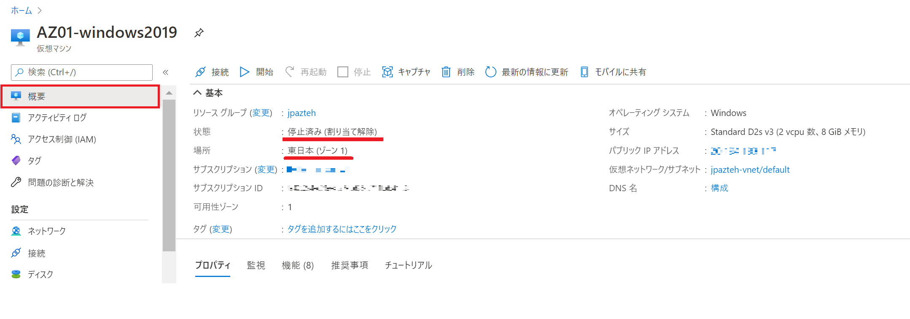
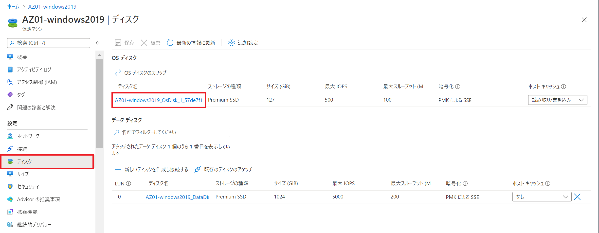
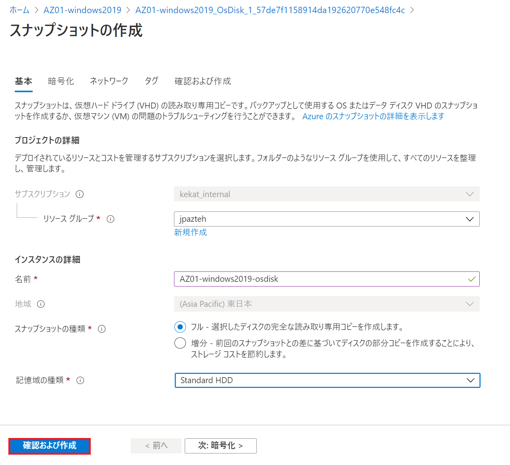
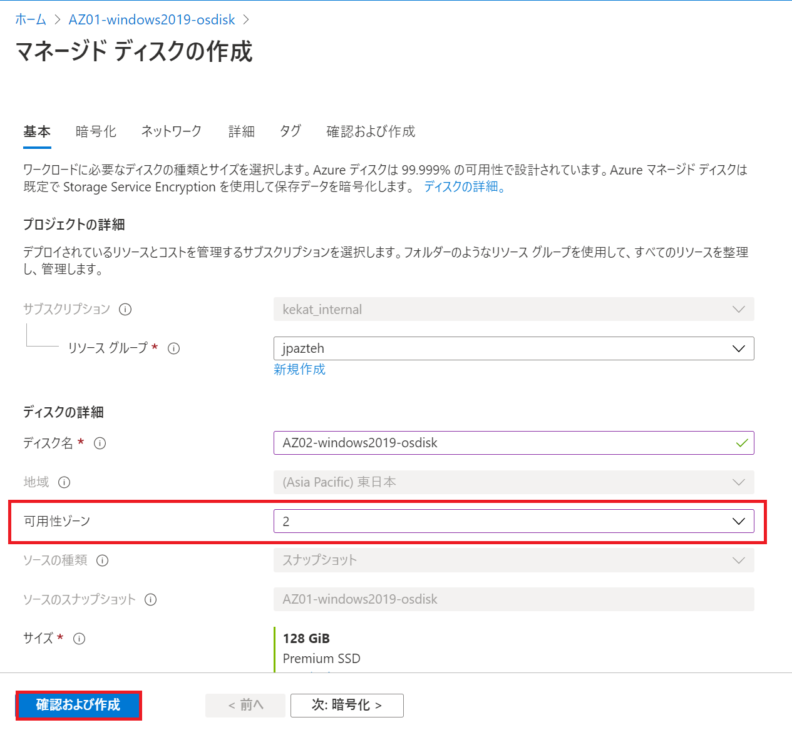
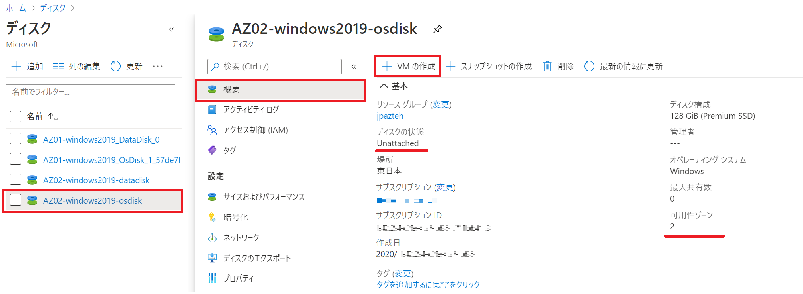
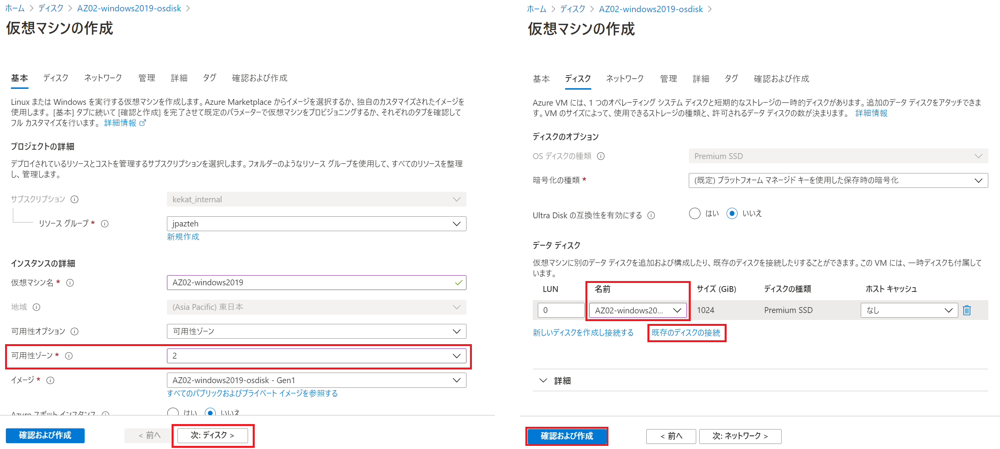

こんにちは、Azure テクニカル サポート チームの松岡です。

Azure VM では、一部リージョンのみとはなりますが可用性ゾーンをサポートしています。

- Azure での Availability Zones をサポートしているリージョン
  [https://docs.microsoft.com/ja-jp/azure/availability-zones/az-region](https://docs.microsoft.com/ja-jp/azure/availability-zones/az-region)

可用性ゾーンを利用した VM を作成したい場合、VM で利用されるディスクも可用性ゾーンを利用している必要があり、一般に VM を新規デプロイする場合にのみ、この利用有無を設定できます。
<!-- more -->

しかし、運用をしている中で VM を可用性ゾーンへ組み入れる必要が発生したり、逆に、可用性ゾーンに組み入れられていると一部機能が対応しないため、可用性ゾーンから外したいという状況もあるかと思います。

本稿では、そのような際、VM の可用性ゾーンを変更する方法について、Azure ポータルからの実施方法をご案内します。

なお、ポータルからではなく、PowerShell を用いた実施方法を以下ブログでご紹介しています。
よろしければこちらもご参照ください。

VM の再作成により可用性ゾーンを変更する (PowerShell 編)
[https://jpaztech.github.io/blog/vm/change-availability-zone-using-powershell/](https://jpaztech.github.io/blog/vm/change-availability-zone-using-powershell/)

## ■ 手順を利用する前提条件

本手順では、管理ディスクを利用していることを前提としてご案内します。

## ■ 手順の流れについて

VM の可用性ゾーンを変更する場合、以下の流れにて作業を行います。

1. VM の停止
2. VM のスナップショットの作成。
3. VM のスナップショットからディスクの作成。
4. ディスクから VM の作成。
5. 作成したスナップショット、および元々利用していたリソースの削除。

例として、VM の可用性ゾーンを1から2へと変更する手順となります。
  

## ■ VM の可用性ゾーンを変更する手順

**1. VM の停止**

Azure ポータルより [Virtual Machines] - [<当該 VM 名>] を開き、VM を停止 (割り当て解除) します。
VM の状態が [停止済み (割り当て解除)] になっていることを確認します。

左メニュー "設定" より [ディスク] を選択し、開いた画面 "OS ディスク" より [<当該 OS ディスク名>] をクリックします。

  

**2. VM のスナップショットの作成**

画面の "＋ スナップショットの作成" をクリックします。

必要項目を適宜入力し、[確認および作成] - [作成] をクリックします。
"記憶域の種類" は、スナップショットを高パフォーマンスのディスクに保存する必要がある場合を除き、 [Standard_HDD] を選択します。

データディスクがある場合、データディスクについても同様にスナップショットを作成します。

  

**3. VM のスナップショットからディスクの作成**

Azure ポータル 上部の検索バーに "スナップショット" と入力し、サービス [スナップショット] を選択します。
上記手順で作成した OS ディスクおよび、データ ディスクのスナップショットが作成されていることを確認します。

OS ディスクのスナップショットを選択し、[+ ディスクの作成] をクリックします。

必要項目を適宜入力し、[確認および作成] - [作成] をクリックします。
可用性ゾーンを希望のゾーン番号に変更します。
この手順では、元々の "1" から "2" へとゾーンを変更しています。

データ ディスクについても同様にディスクを作成します。
  

**4. ディスクから VM の作成**

Azure ポータル上部の検索バーに "ディスク" と入力し、サービス [ディスク] を選択します。
上記手順で作成した OS ディスクおよび、データ ディスクが作成されていることを確認します。

作成した OS ディスクを選択し、[+ VM の作成] をクリックします。
表示されているディスクの状態が "Unattached"、可用性ゾーンが指定した番号であるかを確認します。

必要項目を適宜入力し、[確認および作成] - [作成] をクリックします。
可用性ゾーンの番号は、作成したディスクと同じ番号を指定します。
データ ディスクは [既存のディスクの接続] より、スナップショットから作成したデータ ディスクを適宜選択します。
VNET は同様に既存のものから選択出来ますが、NIC は新規に作成されます。

作成された VM が、指定のゾーン番号で表示されていること(こちらの手順ではゾーン "2" )を確認します。

  

**5. 作成したスナップショット、および元々利用していたリソースの削除**

作成した VM が正常動作することを確認後、元々利用していたリソースおよび、本手順で作成したスナップショットを削除し、手順完了です。
