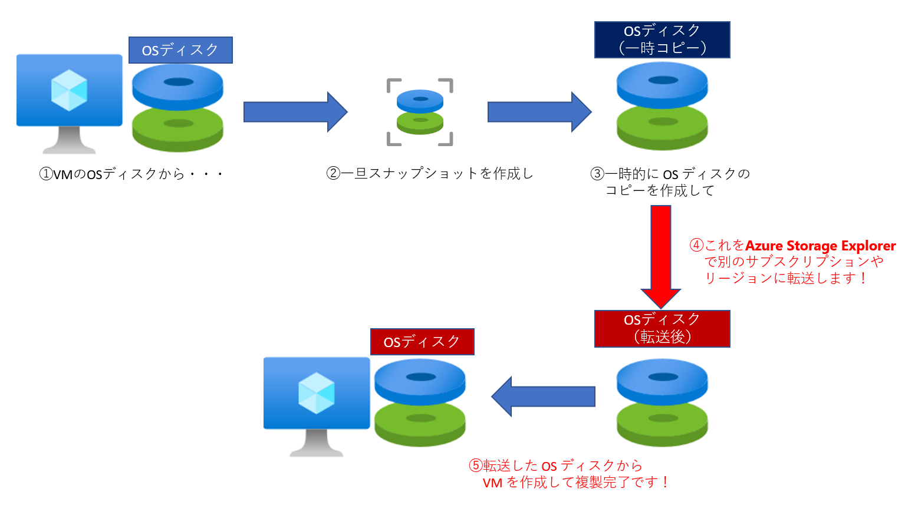
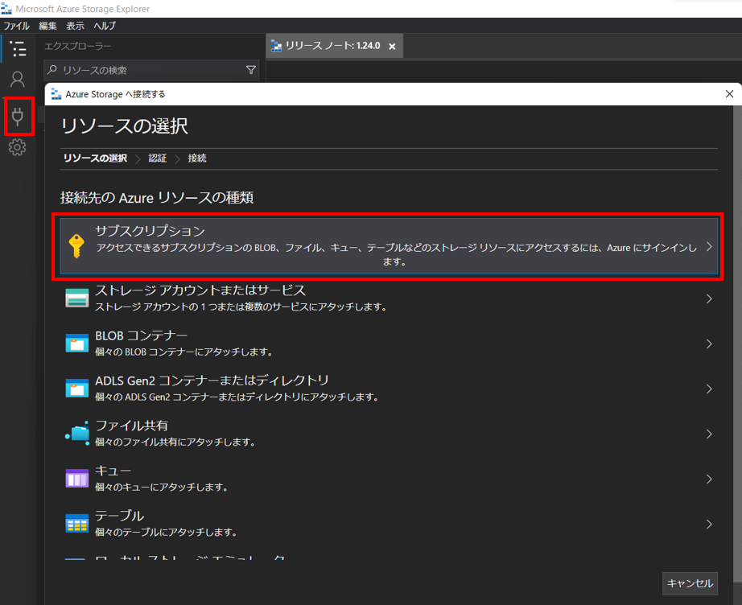
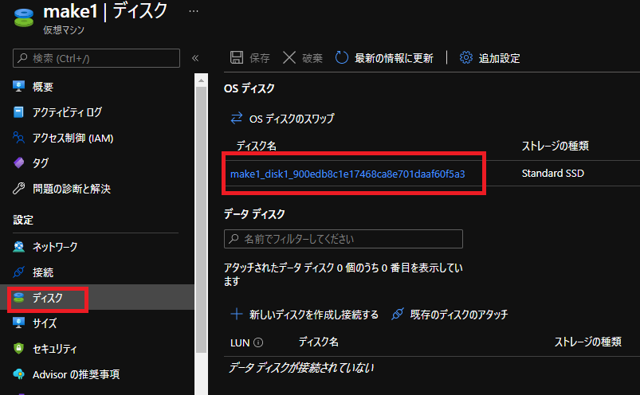
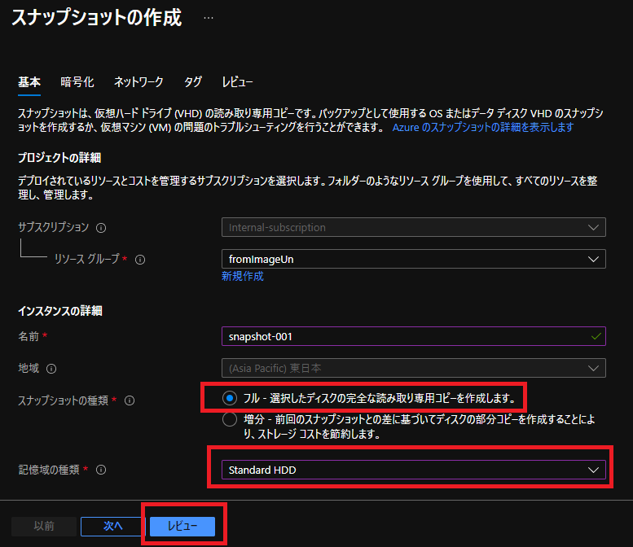
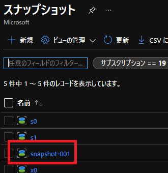
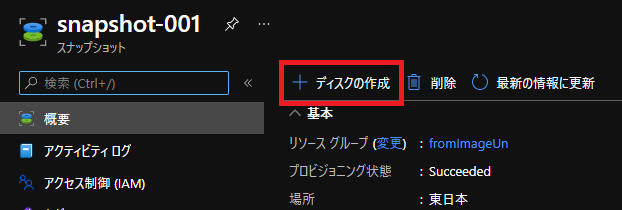
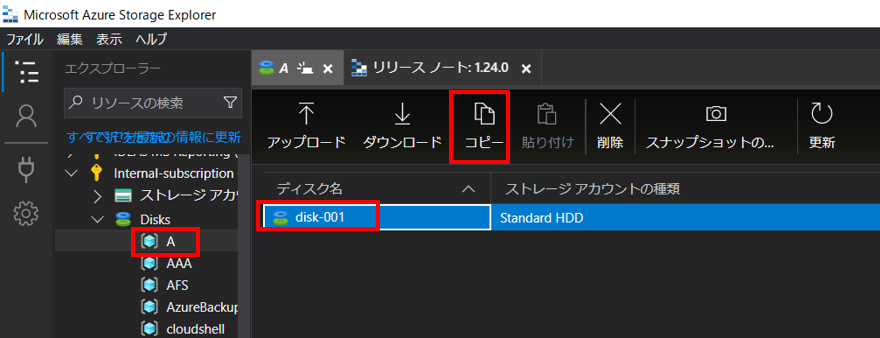
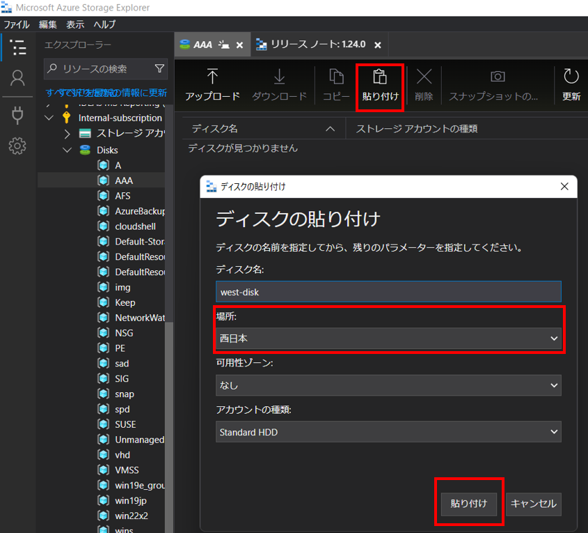

こんにちは、Azure テクニカル サポート チームの富田です。  
   
Azure 上の VM およびマネージドディスクについて、  
 - **別のリージョンに移動/複製をしたい**  
 - **別のサブスクリプションに移動/複製をしたい**  
 - **別のテナントにあるサブスクリプションに移動/複製をしたい**  

というご要望をいただくことがございます。  
   
これらを実現する手段は幾つかありますが、  
Azure Storage Explorer を使うと、上記のご要望がコマンド不要で全て GUI で完結することが可能です！  
今回はこの方法についてスクリーンショットを交えて紹介させていただきます。  
   
# dummy   
---
# 手順の概要について   
まず、大まかな流れについてご説明させていただきます。  
   
 - Azure Storage Explorer をインストールする  
 - Azure Storage Explorer で対象のサブスクリプションに接続する  
 - 対象の VM を割り当て解除（停止）する  
 - 対象 VM の OS ディスクのスナップショットを一時的に作成  
 - スナップショットから転送用ディスクを一時的に作成  
 - 転送用ディスクを移行先に複製する  
 - 複製したディスクから新規に VM を作成する  
 - 不要となったリソースを削除する  
   
勿論この方法で、  
 - マネージドディスクだけを複製する  
 - データディスクも含めて複製する  
 - 同一のサブスクリプション内に VM を複製する  

といったことも可能です。  
   
なお、本手順としては OS ディスクを転送するのですが、  
稼働中の VM の場合は、アタッチ済みの OS ディスクのリージョン間コピーができません。  
また、VM が割り当て解除状態であれば、そのまま VM に接続にアタッチされている OS ディスクの転送は開始できるのですが、  
転送が完了するまでは VM が起動できないという制約もあります。  
   
そのため、一旦 OS ディスクのコピーを一時的に作成して、  
その一時的に作成した OS ディスクのコピーを転送するという方法としております。  
下図のようなイメージです。  

 
   
なお、転送や作成したディスク等には所定の料金が発生したしますのでこの点はご了承くださいませ。  

また、Windows VM を複製しそれをご利用いただく場合、基本的には「一般化したイメージから VM を複製」いただく必要がございます。  
この詳細は [Windows-VM を複製しようとしている方への注意喚起](https://jpaztech.github.io/blog/vm/vm-replica-1/#Windows-VMを複製しようとしている方への注意喚起) をご参照ください。  

それでは早速詳細な手順を見ていきましょう。  

---
# Azure Storage Explorer をインストールする  

Azure Storage Explorer は GUI でマネージドディスクやストレージアカウントのデータ管理を行える、  
とっても便利なソフトウェアとなります！  
  
まずは Azure Storage Explorer をインストールしましょう。  
以下の URL より Azure Storage Explorer を入手することができます。  
   
■ご参考：Azure Storage Explorer  
<https://azure.microsoft.com/ja-jp/features/storage-explorer/>  
   
---
# Azure Storage Explorer で対象のサブスクリプションに接続する  

インストールが完了したら、Azure Storage Explorer を開き、各種操作が可能な Azure ユーザーでログインをします。  
コンセントのアイコンの「接続ダイアログを開く」を選択し、「サブスクリプション」を選択の上ログインを実施ください。  
   
 
   
なお、別のテナントに VM コピーを試みる場合は上記のログイン作業を、２回実施します。  
「移行元サブスクリプション」「移行先サブスクリプション」と 2 つともログインしておきましょう。  
   
---
# 対象の VM を割り当て解除（停止）する  

スナップショットをとるため、対象となる VM を Azure ポータル等で割り当て解除（停止）しましょう。  
   
 
   
スナップショット自体は、VM が起動状態でも取得可能ですが、  
移行後の VM の不具合を防止するため VM 停止状態でスナップショットを取得することを強く推奨いたします。  
   
---
# OS ディスクのスナップショットを一時的に作成  

VM 停止が完了したら、VM の \[ディスク\] ブレードより、複製を行いたいディスクを選択します。  
   
 
   
上部にある \[スナップショットの作成\] を選択します。  
   
 
   
スナップショット作成のオプションを選択します。  
下記は一例とはなりますが、今回はスナップショットの種類は \[フル\] とし、記憶域の種類は \[Standard HDD\] としています。  
設定が完了したら、\[レビュー\] を選択し、スナップショットを作成します。  
   
  
   
これでスナップショット取得が完了となります。  
なお、スナップショット取得の所要時間は一概には言えませんが、手元の Windws OS ディスク 128 GB では十数秒で完了しました。  
スナップショット取得が完了したら、VM を起動頂いて大丈夫です。  
   
---
# スナップショットから転送用ディスクを一時的に作成  

先ほど取得したスナップショットから一時的に転送用ディスクを作成します。  
まずは、ポータル上部の検索ボックスで \[スナップショット\] を検索し、選択します。  
   
 
   
先ほど取得したスナップショットを一覧より選択します。  
   
 
   
上部に表示される \[ディスクの作成\] を選択します。  
   
 
   
「転送用ディスク」としてマネージドディスクを作成します。  
基本的には、デフォルトの設定で問題無いかと思いますが、下記例ではサイズにて \[Standard HDD\] のディスクを作成するように設定しています。  
設定が完了したら \[確認および作成\] を選択し、マネージドディスクを作成します。  
   
 
   
---
# 対象の VM の OS ディスクを移行先に複製する  

無事に「転送用ディスク」が作成できたら、これを転送先にコピーしましょう。  
   
Azure Storage Explorer にて、  
左側のエクスプローラーより先ほど作成した「転送用ディスク」あるリソースグループを選択します。  
そして、対象のディスクを選択し「コピー」を選択します。  
   
   
   
次に、エクスプローラーで複製先となるリソースグループを選択の上、「貼り付け」を選択します。  
この際、別テナントや別サブスクリプション上のリソースグループも選択が可能です。  
以下のように複製先のリージョンを選ぶことが可能となっております。  
   
 
   
同一リソースグループ内に同一名のマネージドディスクは作成が叶いませんので、その際は上記画面でディスク名を変更くださいませ。  
なお、転送状況は以下の通り Azure Storage Explorer 下部のアクティビティタブにてご確認が可能です。  
   
 
   
なお、データディスクも合わせて複製する必要がある場合は同様の手順で、OS ディスクと合わせて複製を行ってください。  
   
---
# 複製した OS ディスクから新規に VM を作成する  

Azure ポータルで、移行先の複製した OS ディスクのリソースを表示します。  
複製した OS ディスクから以下の通り VM 作成が可能です。  
   
 
   
データディスクがある場合は、この VM 作成時にデータディスクをアタッチしましょう。  
   
---
# 不要となったリソースを削除する  

不要な課金を無くすためにも、この手順で一時的に作成した「スナップショット」および「転送用のマネージドディスク」を削除しましょう。  
また VM 複製でなく VM 移動の場合は、複製完了後に移行元の VM および不要なリソースを削除いただくようにお願いいたします。  

---
以上が Azure Storage Explorer を用いて、コマンド無しで VM を別のリージョン・サブスクリプション・テナントに移動/複製する方法でした。  
こちらの内容が皆様のお役に立てれば幸いでございます。