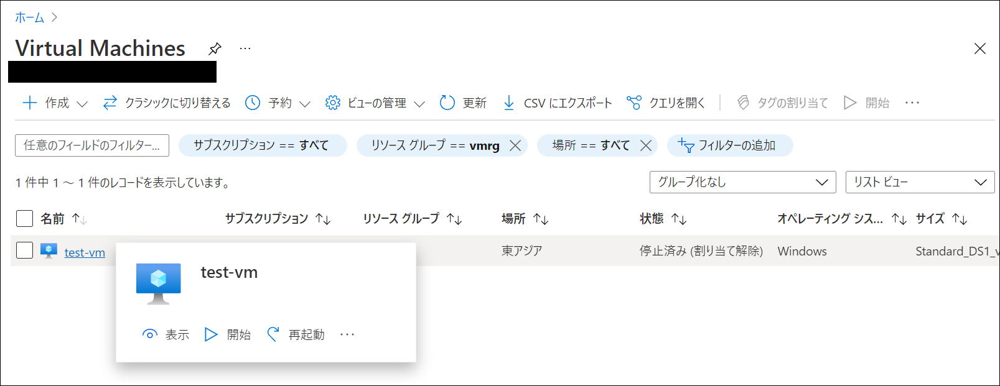
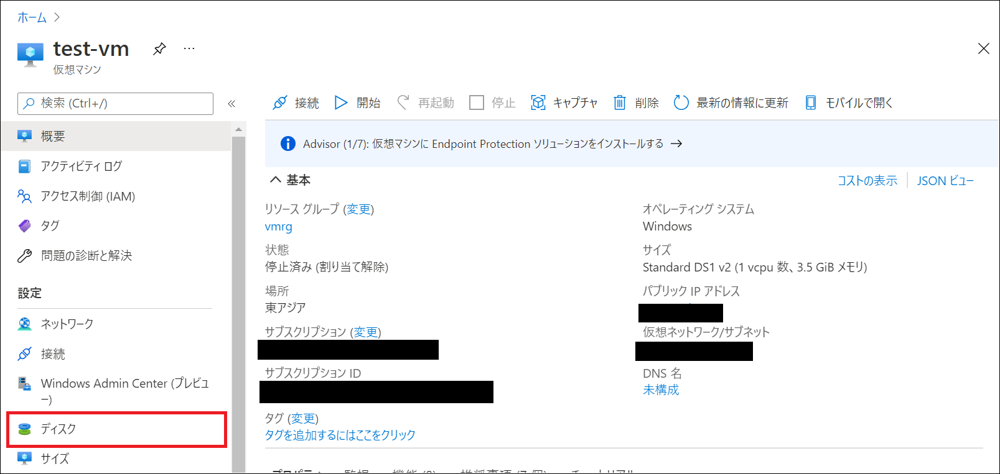
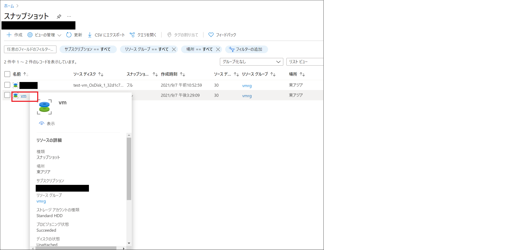
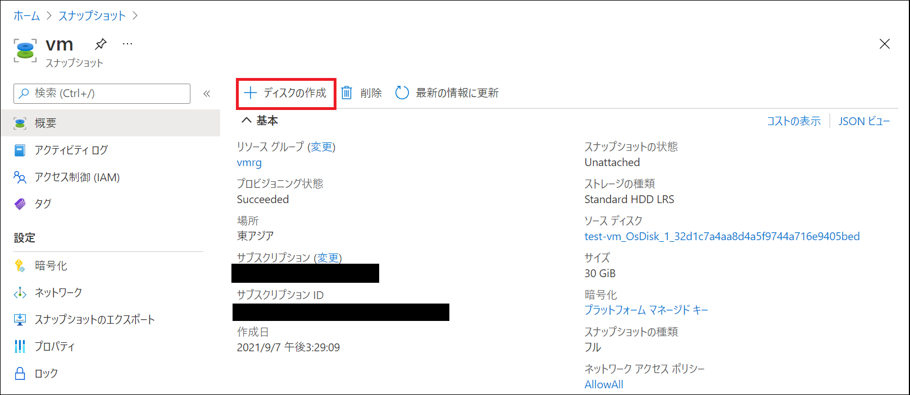
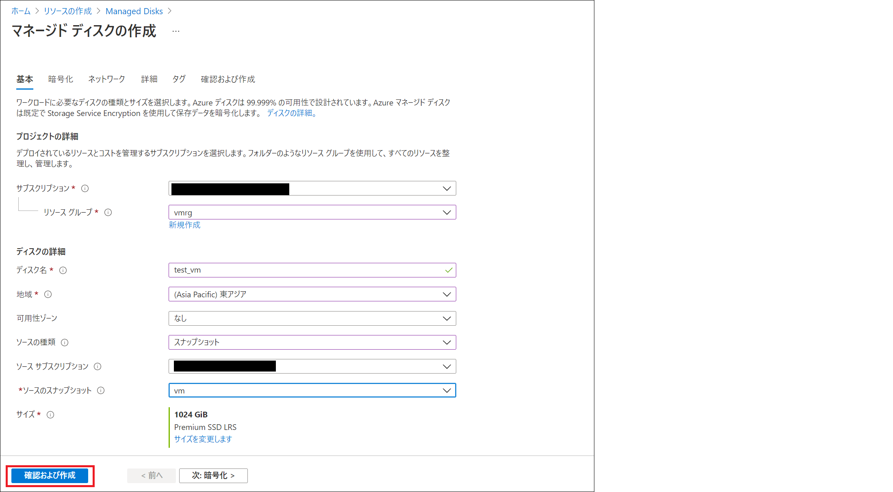
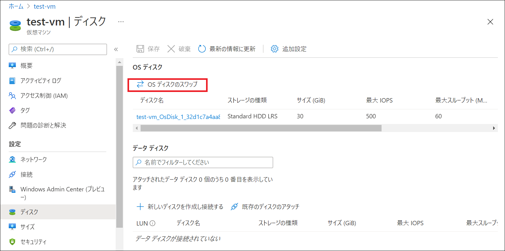
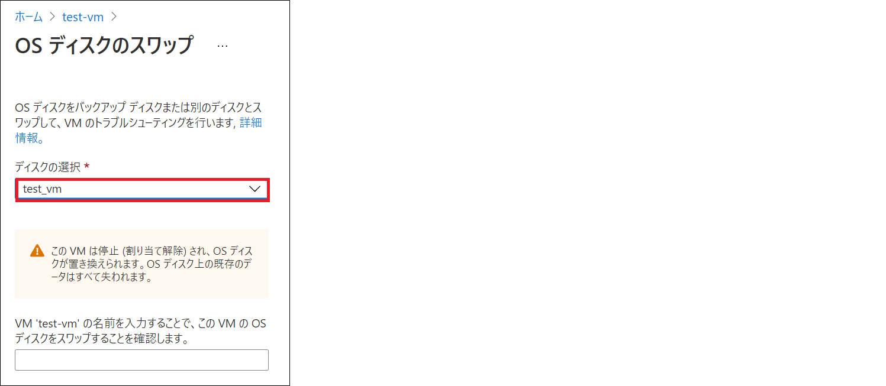

こんにちは。Azure テクニカル サポート チーム、インターン生の藤澤です。

Azure VM を作成いただく際、OS ディスクのリソース名は自動で生成されますが、リソース管理の都合上、この OS ディスクのリソース名を任意の名前に変更したいというお問い合わせをいただくことがあります。
本記事では、既存 VM の OS ディスクのリソース名を変更する手順について紹介します。

<!-- more -->

---

## 概要

手順としては、大きく 3 つの作業を実施します。
Windows VM、Linux VM ともに同様の手順となります。

1. OS ディスクのスナップショットを作成する
2. スナップショットから管理ディスクを作成する
3. 元の OS ディスクと 2 のディスクを入れ替える (スワップする)

---

## 手順
### 1. OS ディスクのスナップショットを作成する

1. Azure Portal の上部検索バーから、[Vitual Machines] で検索します。
   

2. 対象の VM を選択します。
   

3. 画面左下の [ディスク] を選択します。
   

4. OS ディスク (リソース名を変更するディスク) を選択します。
   

5. [スナップショットの作成] をクリックします。
   

6. 必要事項を入力後、[作成] を選択します。

   > ご参考：Azure リソースの名前付け規則と制限事項 - Microsoft.Compute
   >[https://docs.microsoft.com/ja-jp/azure/azure-resource-manager/management/resource-name-rules#microsoftcompute](https://docs.microsoft.com/ja-jp/azure/azure-resource-manager/management/resource-name-rules#microsoftcompute)
   > 参照箇所：disks

   

### 2. スナップショットから管理ディスクを作成する

7. Azure Portal の上部検索バーで [スナップショット] と検索します。
   

8. 作成したスナップショット (手順 1 ~ 6) を選択します。
   

9. [ディスクの作成] を選択します。
   

10. 必要項目を適宜入力し、[確認および作成] をクリックします。
    変更後の OS ディスク名は、"ディスクの詳細" の "ディスク名" で任意の値を入力してください。
    

### 元の OS ディスクと 2 のディスクを入れ替える (スワップする)

11. 上部検索バーで [ディスク] と検索します。
    

12. 作成したディスクを選択します。
    

13. [OS ディスクのスワップ] をクリックします。
    

14. 作成したディスクを選択します。
    

15. ディスクのリソース名が反映されているか確認します。
    仮想マシンを起動・接続し、問題なく動作することをご確認ください。
    

### 補足

OS ディスクのスワップが完了した後には、念のため VM が正しく動作すること (ゲスト OS が起動し、アプリケーション等の動作に問題がないこと) をご確認ください。

16. VM を起動します。

17. VM に接続し、正しく動作することを確認します。

18. 必要に応じてスワップ後の元ディスクを削除します。

> [!WARNING]
> 管理ディスクは、使用するディスク領域の量に関係なく、作成したディスクの種類に応じて固定料金で課金されます。
> 上記手順を実施いただいた後は、必要に応じて元ディスクを削除してください。
> 　
> **ご参考**
> ・[Azure IaaS VM 用のディスクの種類の選択](https://docs.microsoft.com/ja-jp/azure/virtual-machines/disks-types)) 
> ・[Managed Disks の価格](https://azure.microsoft.com/ja-jp/pricing/details/managed-disks/)

手順は以上となります。
本記事が皆様のお役に立てれば幸いです。