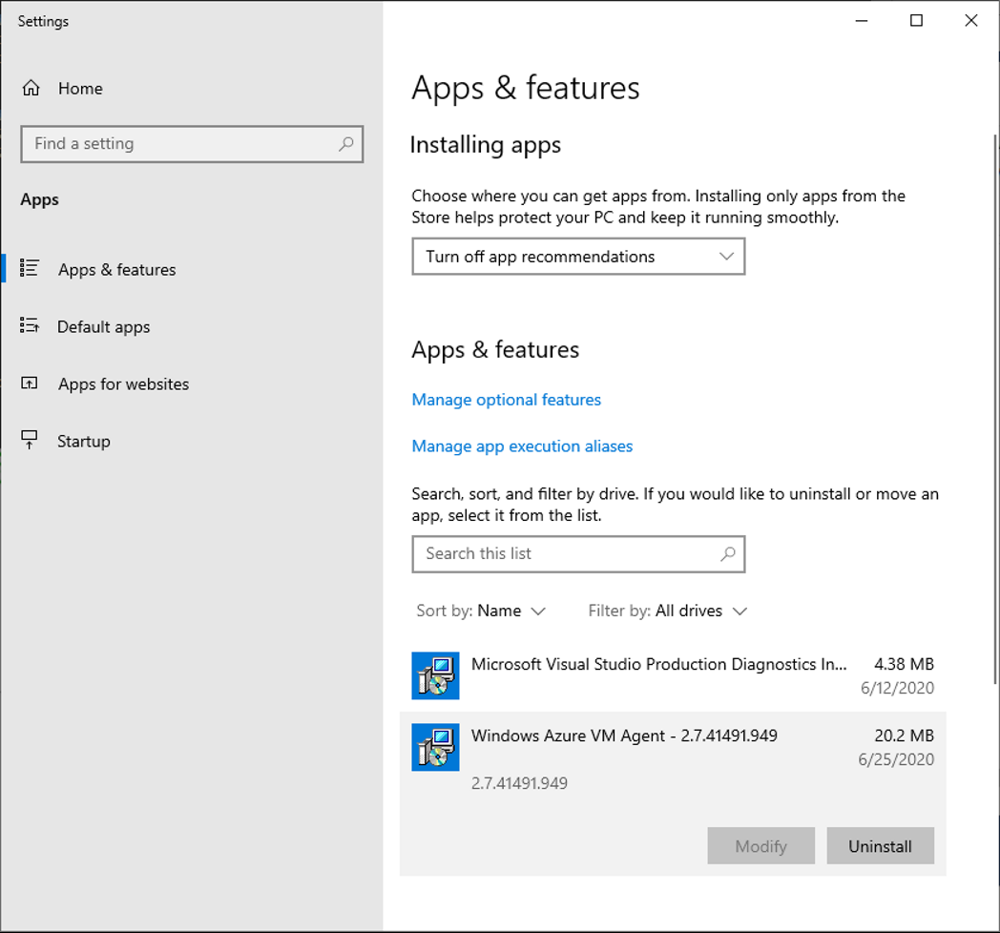

こんにちは、Azure テクニカル サポート チームの富田です。

お問い合わせでご案内する頻度が多い、Windows ゲスト エージェント (WinGA) の再インストール方法をご案内いたします。
WinGAが正常に動作しなくなった場合に再インストールを行うことで正常動作に戻ることが多くあります。

今回は下記画像の3つのサービスを一旦削除し、インストールを行うシナリオとなります。  
なお、バージョン 2.7.41491.971 から、WindowsAzureTelemetryService は RDAgent に統合されたため、 WindowsAzureTelemetryService が表示されない場合は WindowsAzureTelemetryService の停止・削除は不要となります。 
WindowsAzureTelemetryService が表示されない場合は WindowsAzureTelemetryService の停止・削除は不要となります。  

 

## 再インストール方法

1. 現在のWinGAをアンインストールします。  
    スタートを右クリックして、「Apps and Features」を選択します。  
    下記のように「Windows Azure VM Agent」がインストールされている場合は「Uninstall」を選択してください。

     

    WinGAが最初からインストールされているイメージを使用した際は、「Windows Azure VM Agent」の表示はありませんのでこの操作は不要です。

1. 管理者権限でコマンドプロンプトを起動します。

1. 下記のコマンドでサービスを停止します。既に停止している場合は不要です。
    もしサービスが停止できない場合は、  
    スタートメニューより[サービス] を検索 → 対象のサービスを右クリック → [プロパティ] → スタートアップの種類を [手動] に設定して VM を再起動してください。  

    ```CMD
    net stop rdagent
    net stop WindowsAzureGuestAgent
    net stop WindowsAzureTelemetryService
    ```

1. 下記コマンドでサービスの削除を行います。

    ```CMD
    sc delete rdagent
    sc delete WindowsAzureGuestAgent
    sc delete WindowsAzureTelemetryService
    ```

1. インストール前に不要ファイルの移動を行います。  
    "C:\WindowsAzure" 内に "OLD" というフォルダを作成します。  
    "C:\WindowsAzure" 内に "Packages" または "GuestAgent" というフォルダがあった場合は、作成した "OLD" フォルダに移動させてください。

1. 下記リンクより最新のインストーラーをダウンロードします。  
    https://go.microsoft.com/fwlink/?LinkID=394789

1. ダウンロードしたインストーラーを "C:\VMAgentMSI" に配置します。

1. 下記コマンドでインストールを実行します。  
    \<Version\>はインストーラーのファイル名のバージョンに合わせて書き換えて実行してください。  
    
    ```CMD
    msiexec.exe /i c:\VMAgentMSI\WindowsAzureVmAgent.2.7.<version>.fre.msi /quiet /L*v c:\VMAgentMSI\msiexec.log
    ```

1. これにてWinGAの再インストールは完了となります。  
    なお、サービスが起動するまでに1,2分程度かかる場合があります。  
    インストールが失敗した場合は "C:\VMAgentMSI\msiexec.log" の内容を参照してください。
