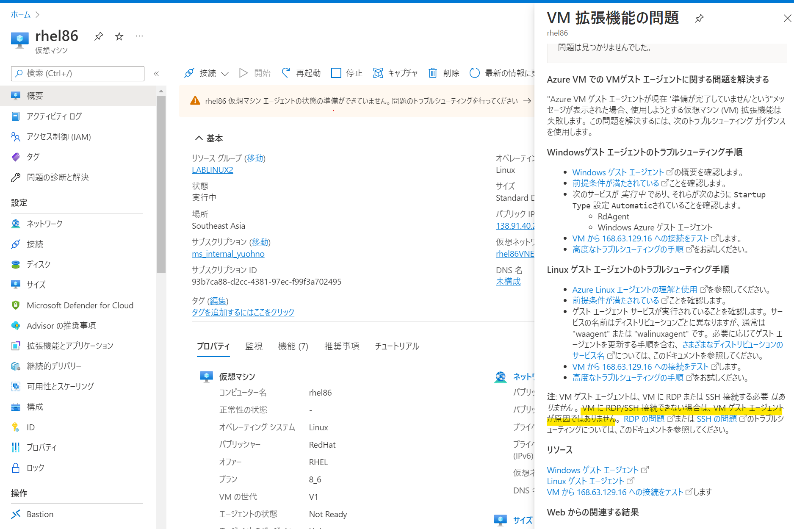

こんにちは、Azure テクニカル サポート チームの大野です。

今回は、度々お問合せいただきます、こちらのメッセージについて、
想定される原因およびその判断ポイント、対処についてご紹介いたします。

<!-- more -->

結論からお伝えすると、このメッセージが表示されることが、
必ずしも対象仮想マシンへのネットワーク疎通が取れないことを意味するわけではありません。

 

想定されるシナリオについては、以下 4 つに分類されるかと思います。

## 「仮想マシンエージェントの状態が準備できていません」の想定シナリオ

|シナリオ番号|想定されるシナリオ|SSH / RDP 接続可否|
|---------|-----------------|----------------------|
|1|仮想マシン エージェントが停止している|可|
|2|Wire Server (168.63.129.16) への疎通がゲストOS でブロックされている|可|
|3|ネットワーク インターフェースが無効化されている|不可|
|4|ゲスト OS がハング等により稼働していない|不可|

## シナリオ1 : 仮想マシン エージェントが停止している

意図的に仮想マシン エージェントのプロセスを停止されている他、
仮想マシン エージェントに内在する不具合によって起動していないケースもございます。

この場合、対象仮想マシンへの SSH 接続は引き続き可能ですが、
影響としては、仮想マシン エージェントが拡張機能の管理も兼ねているため、
拡張機能のインストールや動作に問題が生じることが想定されます。

それでは、Linux (Red Hat Enterprise Linux 8.6) で試してみます。

```sh
[root@rhel86 ~]# systemctl status waagent.service 
● waagent.service - Azure Linux Agent
   Loaded: loaded (/usr/lib/systemd/system/waagent.service; enabled; vendor preset: disabled)
  Drop-In: /usr/lib/systemd/system/waagent.service.d
           └─10-Slice.conf, 11-CPUAccounting.conf, 12-CPUQuota.conf
   Active: active (running) since Sun 2022-08-14 15:09:14 UTC; 3min 6s ago
 Main PID: 1484 (python3.6)
    Tasks: 6 (limit: 49437)
   Memory: 40.8M
      CPU: 6.239s
   CGroup: /azure.slice/waagent.service
           ├─1484 /usr/bin/python3.6 -u /usr/sbin/waagent -daemon
           └─1719 /usr/bin/python3.6 -u bin/WALinuxAgent-2.7.3.0-py2.7.egg -run-exthandlers

...(省略)...

[root@rhel86 ~]# systemctl stop waagent.service 
[root@rhel86 ~]# systemctl status waagent.service
● waagent.service - Azure Linux Agent
   Loaded: loaded (/usr/lib/systemd/system/waagent.service; enabled; vendor preset: disabled)
  Drop-In: /usr/lib/systemd/system/waagent.service.d
           └─10-Slice.conf, 11-CPUAccounting.conf, 12-CPUQuota.conf
   Active: inactive (dead) since Sun 2022-08-14 15:12:35 UTC; 6s ago
  Process: 1484 ExecStart=/usr/bin/python3.6 -u /usr/sbin/waagent -daemon (code=exited, status=0/SUCCESS)
 Main PID: 1484 (code=exited, status=0/SUCCESS)
      CPU: 6.318s

...(省略)...
```

しばらくしてから、対象仮想マシンの概要欄を確認すると、エラーになっていることがご確認いただけるかと思います。
一方、この状態では特段問題なく、SSH 接続いただけるかと思います。

 


### 判断いただくポイント

このシナリオでは、SSH / RDP 接続が可能なため、
まずは対象仮想マシンにアクセスいただき、仮想マシン エージェントのサービスが起動しているか確認いただければと思います。

### 想定される対処について

仮想マシン エージェントが停止している場合には、手動で起動を実施いたします。

 - [準備ができていない状態のトラブルシューティング - Azure Linux エージェントのトラブルシューティング](https://docs.microsoft.com/ja-jp/troubleshoot/azure/virtual-machines/linux-azure-guest-agent#troubleshoot-a-not-ready-status)

もし、手動で起動してもエラーとなるようでしたら、仮想マシン エージェントを更新し、
再度お試しいただき、起動いただけるか、ご確認ください。

 - [VM で Azure Linux エージェントを更新する方法](https://docs.microsoft.com/ja-jp/azure/virtual-machines/extensions/update-linux-agent)

## シナリオ2 : Wire Server (168.63.129.16) への疎通がゲストOS でブロックされている

Wire Server (168.63.129.16) は、仮想マシン内からのみアクセス可能な仮想パブリック IP アドレスになります。
仮想マシン エージェントからこの IP アドレスに対して正常性の通知を行っています。

この IP アドレスへの通信は、ネットワーク セキュリティ グループ (NSG) で制限することはできませんが、
ゲスト OS のファイアウォール機能にて制限は可能です。

試してみます。
 
```sh
[root@rhel86 ~]# curl http://168.63.129.16/?comp=versions
<?xml version="1.0" encoding="utf-8"?>
<Versions>
  <Preferred>
    <Version>2015-04-05</Version>
  </Preferred>
  <Supported>
    <Version>2015-04-05</Version>
    <Version>2012-11-30</Version>
    <Version>2012-09-15</Version>
    <Version>2012-05-15</Version>
    <Version>2011-12-31</Version>
    <Version>2011-10-15</Version>
    <Version>2011-08-31</Version>
    <Version>2011-04-07</Version>
    <Version>2010-12-15</Version>
    <Version>2010-28-10</Version>
  </Supported>
</Versions>
```

168.63.129.16 に対して、アウトバウンド方向の通信を遮断します。

```sh
[root@rhel86 ~]# firewall-cmd --direct --add-rule ipv4 filter OUTPUT 0 -d  168.63.129.16/32 -j DROP
success
[root@rhel86 ~]# firewall-cmd --direct --get-all-rules
ipv4 filter OUTPUT 0 -d 168.63.129.16/32 -j DROP
```

遮断されていることを確認します。

```
[root@rhel86 ~]# curl http://168.63.129.16/?comp=versions
curl: (7) Failed to connect to 168.63.129.16 port 80: Connection timed out
```

しばらく経つと、こちらの場合も、Azure ポータルから仮想マシン エージェントに問題がある旨ご確認いただけるかと思います。

### 判断いただくポイント

シナリオ1 と同様に、SSH 接続は引き続き可能なため、
対象仮想マシンに SSH 接続いただき、シナリオ1 の点を確認いただければと思います。

こちらが問題なければ、168.63.129.16 に対してネットワーク疎通が取れているか確認いただくことで、
ご判断いただけるかと思います。

 - [接続のトラブルシューティング - IP アドレス 168.63.129.16 とは](https://docs.microsoft.com/ja-jp/azure/virtual-network/what-is-ip-address-168-63-129-16#troubleshoot-connectivity)

その他ご判断いただく点といたしましては、仮想マシン エージェントのログ (```/var/log/waagent.log```) にて、
以下のようなログの出力からも Wire Server への疎通に問題があるということをご判断いただけるかと思います。

```sh
2022-08-11T07:27:33.509406Z ERROR SendTelemetryHandler ExtHandler Event: name=WALinuxAgent, op=ReportEventErrors, message=DroppedEventsCount: 1
Reasons (first 5 errors): [ProtocolError] [Wireserver Exception] [HttpError] [HTTP Failed] POST http://168.63.129.16/machine -- IOError timed out -- 6 attempts made: Traceback (most recent call last):
```

### 想定される対処について

上記の例では、ゲスト OS 内のファイアウォールの対象ルールを無効化いただくことで、
対処いただけますが、一概にこの点だけ確認すればよいというご案内ができないため、
適宜どのような制限が設定されているかご確認ください。

```sh
[root@rhel86 ~]# firewall-cmd --direct --remove-rule ipv4 filter OUTPUT 0 -d  168.63.129.16/32 -j DROP
success
[root@rhel86 ~]# firewall-cmd --direct --get-all-rules
[root@rhel86 ~]#
```

また、特段制限をされていない場合、Wire Server 側に問題があることが想定されますので、
該当仮想マシンのご利用に影響がない時間を調整いただき、仮想マシンの再デプロイをご実施いただければと思います。

## シナリオ3 : ネットワークインターフェースが無効化されている

こちらが仮想マシン エージェントが稼働していない = ネットワーク接続できないと思われてしまうシナリオになります。
これは反対で、アウトバウンド方向のネットワーク疎通が取れないために、結果として仮想マシン エージェントから Wire Server にアクセスができず、
仮想マシン エージェントの状態が Not Ready となります。

試しにネットワーク インターフェース eth0 を無効化してみます。
しばらく待つと、SSH 接続が途切れます。

```sh
[root@rhel86 ~]# ifconfig eth0 down
client_loop: send disconnect: Broken pipe
```

その後再度 SSH 接続を試みますが、失敗します。

```sh
❯ ssh azureuser@xx.xxx.xxx.xxx
ssh: connect to host xx.xxx.xxx.xxx port 22: Connection timed out
```

また、仮想マシン エージェントが準備できていない旨のエラー メッセージが Azure ポータル上でご確認いただけるかと思います。

### 判断いただくポイント

こちらは対象仮想マシンのブート診断から参照可能なシリアル ログにて、下記のようにログイン プロンプトが表示されているかご確認いただければと思います。
(Windows の場合には、ブート診断機能で、スクリーンショットにロック画面が表示いただけるかの確認になります)。

 

上記より、ゲスト OS としては稼働しているものの、ネットワークとして疎通が取れていないということが想定されます (シナリオ4 との切り分け)。

### 想定される対処について

ゲスト OS にてネットワークの疎通の問題においても、種々原因が上げられますため、
必ずこれを行えば解決するというものではございませんが、以下のネットワーク インターフェースのリセットや、
IP アドレスの固定化が設定されていないかご確認いただければと思います。

 - [Azure Linux VM のネットワーク インターフェイスをリセットする](https://docs.microsoft.com/ja-jp/troubleshoot/azure/virtual-machines/reset-network-interface-azure-linux-vm)

 上記と併せ、下記ドキュメントの "VM に接続できない" より、Linux / Windows それぞれ特化したトラブルシューティング手順をご確認ください。

 - [Azure Virtual Machinesトラブルシューティングのドキュメント](https://docs.microsoft.com/ja-jp/troubleshoot/azure/virtual-machines/welcome-virtual-machines)

## シナリオ4 : ゲスト OS がハング等により稼働していない

ゲスト OS が動作しておらず、結果その上で仮想マシン エージェントが動作していないというシナリオになります。


### 判断いただくポイント

シナリオ3 と同様、シリアル ログをご確認いただき、ログイン プロンプトが返ってきているかご確認いただき、
もしそうなっていないのであれば、ゲスト OS で正常にブートしていない可能性があります
(Windows の場合には、ブート診断機能で、スクリーンショットにロック画面が表示いただけるかの確認になります)。

下記の例では、存在しないマウントポイントをブート時にマウントしようとしてしまい、
Emergency モードで起動している状況になります。

 


### 想定される対処について

再起動/再デプロイにより、復旧いただけるかまずはご確認いただくことと、
取得済みのバックアップ データから復旧いただくこととなります。

もし上記施策が当てはまらない場合は、下記仮想マシンのトラブルシューティング ガイドにあります、"VM のデプロイ、アップグレード、移行" の "VM がブートしていない" に、
Linux / Windows それぞれ特化したトラブルシューティング手順があるので、ご参考いただければと思います。
また、シリアルコンソール機能のご利用が必要となりましたら、同じく下記ドキュメントの "リモート トラブルシューティング ツール" の "シリアル コンソール" を併せてご確認いただければと思います。

 - [Azure Virtual Machinesトラブルシューティングのドキュメント](https://docs.microsoft.com/ja-jp/troubleshoot/azure/virtual-machines/welcome-virtual-machines)

本記事が皆様のお役に立てれば幸いです。
